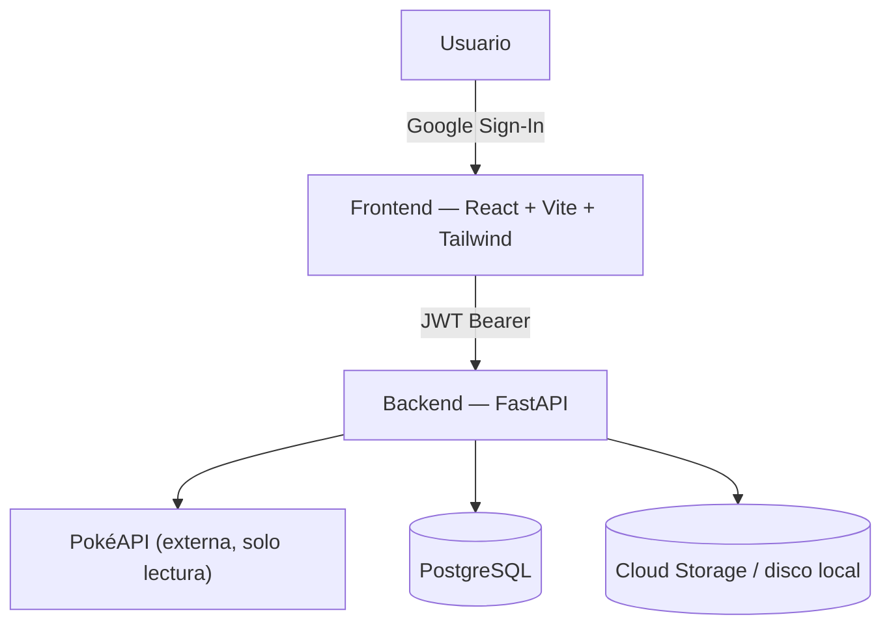

# PokéDex Manager

Aplicación web full-stack para gestionar una colección personal de Pokémon:
inicio de sesión con Google, exploración de la Pokédex (vía PokéAPI) y una
colección propia con edición, favoritos y notas.



Ver [`docs/ARCHITECTURE.md`](docs/ARCHITECTURE.md) para el diagrama completo y
las decisiones de diseño, y [`docs/POKEAPI_DECISION.md`](docs/POKEAPI_DECISION.md)
para cómo se resuelve la integración con la API externa.

## Stack

| Capa | Tecnología |
|---|---|
| Backend | FastAPI (Python 3.11+), SQLAlchemy 2.0, Alembic, `httpx` async |
| Frontend | React 18 + Vite + TypeScript, Tailwind CSS, TanStack Query, React Router |
| Base de datos | PostgreSQL (Cloud SQL en GCP / contenedor en local) |
| Auth | Google Identity Services (OAuth2/OIDC) + JWT propio de sesión |
| Almacenamiento de imágenes | Google Cloud Storage (o disco local en dev) |
| Infra | Docker Compose (local) + scripts `.sh` para Cloud Run/Cloud SQL/GCS (GCP) |

## Funcionalidades implementadas (core)

- **Autenticación con registro obligatorio**: login y registro son endpoints
  separados (`/auth/google/login` y `/auth/google/register`). El login
  **nunca** crea usuarios — si la cuenta de Google no existe en la base de
  datos, el backend responde 404 y el frontend muestra un formulario de
  registro autocompletado con el nombre/foto de Google (editable). Solo
  entran usuarios que completaron el registro. Ver
  `docs/ARCHITECTURE.md#4-autenticación--flujo-login-y-registro-separados`.
- **Integración con PokéAPI**: búsqueda y listado paginado de Pokémon
  (solo lectura, catálogo externo), con caché en el backend (ver
  `docs/POKEAPI_DECISION.md`).
- **Gestión de datos y persistencia — CRUD completo de la colección**:
  crear, leer, actualizar y borrar Pokémon de tu colección personal (apodo,
  nivel, notas, favorito, imagen propia), estadísticas agregadas
  (`/collection/stats`). Guía paso a paso para probar el CRUD con Postman:
  [`docs/POSTMAN_GUIDE.md`](docs/POSTMAN_GUIDE.md).
- **Interfaz responsive**: mobile-first, paleta pastel azul/verde-azulado,
  tarjetas con tipos de Pokémon coloreados, spinner temático (Pokéball).

## Funcionalidades bonus (IA)

- **Identificar Pokémon por foto** (`/identificar`): sube una imagen y **Gemini
  2.5 Flash** (Vertex AI) la identifica — nombre, descripción, fun fact, y (si
  coincide con la Pokédex real) tipos y ventajas/desventajas.
- **Chat sobre tu colección** (`/chat`): **Claude Sonnet 5** responde preguntas
  con acceso real a tu colección vía un servidor **MCP** propio; el historial se
  guarda en Firestore.
- **Insights de colección** (`/insights`): equipo ideal, fortalezas/debilidades y
  sugerencias generadas por IA a partir de tu colección actual.

Requieren un par de pasos manuales de configuración (una API key de Anthropic y
crear la base de Firestore) que **no** son necesarios para las funciones core —
ver [`docs/BONUS_FEATURES.md`](docs/BONUS_FEATURES.md) para el paso a paso y las
decisiones de arquitectura detrás de cada una.

## Cómo correr el proyecto localmente (recomendado para evaluar)

Requisitos: Docker y Docker Compose.

```bash
git clone <url-de-tu-repo> pokedex-manager
cd pokedex-manager
cp .env.example .env
# Edita .env y agrega tu Google Client ID (ver sección "Configurar Google Sign-In" abajo)

docker compose up --build
```

- Frontend: http://localhost:5173
- Backend (Swagger UI): http://localhost:8000/docs
- Backend (health check): http://localhost:8000/health

Las migraciones de Alembic corren automáticamente al iniciar el contenedor
del backend (`alembic upgrade head`).

### Correr sin Docker (backend y frontend por separado)

```bash
# Backend
cd backend
python3 -m venv .venv && source .venv/bin/activate
pip install -r requirements.txt
export $(grep -v '^#' ../.env | xargs)   # o exporta las variables manualmente
alembic upgrade head
uvicorn app.main:app --reload

# Frontend (en otra terminal)
cd frontend
npm install
npm run dev
```

### Correr los tests del backend

```bash
cd backend
source .venv/bin/activate
pytest -q
```

## Configurar Google Sign-In (necesario para poder iniciar sesión)

1. Ve a [Google Cloud Console → Credentials](https://console.cloud.google.com/apis/credentials).
2. Configura el "OAuth consent screen" (tipo External, datos básicos).
3. Crea un **OAuth Client ID** de tipo **Web application**.
4. En **Authorized JavaScript origins** agrega `http://localhost:5173`.
5. Copia el Client ID y colócalo en:
   - `.env` (raíz) → `GOOGLE_CLIENT_ID` y `VITE_GOOGLE_CLIENT_ID`
   - o `frontend/.env` / variables de entorno del backend si corres sin Docker.

Sin esto, la app funciona pero el botón de Google no podrá autenticar
(las rutas de la Pokédex y la colección requieren sesión iniciada).

## Desplegar en Google Cloud Platform (opcional)

El enunciado aclara que **no es necesario** desplegar en producción, pero se
incluyen scripts `.sh` completos para hacerlo con Cloud Run + Cloud SQL + GCS.
Ver la guía paso a paso: [`docs/GCP_DEPLOYMENT.md`](docs/GCP_DEPLOYMENT.md).

```bash
cd infra/gcp
export PROJECT_ID=tu-proyecto-gcp
./01-enable-apis.sh && ./02-service-accounts-iam.sh && ./03-cloud-sql.sh \
  && ./04-storage-bucket.sh && ./05-artifact-registry.sh && ./06-secrets.sh \
  && ./07-build-push.sh && ./08-deploy-backend.sh && ./09-deploy-frontend.sh
```

### CI/CD — desplegar automáticamente en cada push

Por defecto lo anterior es manual. Si quieres que un `git push` a `main`
dispare el build y el deploy solo (sin guardar llaves de service account en
GitHub), sigue [`docs/CI_CD.md`](docs/CI_CD.md) — usa Cloud Build Triggers
conectado directo a tu repo.

### ¿Ya desplegaste antes y solo actualizaste el código?

Ver [`docs/MANUAL_EJECUCION.md`](docs/MANUAL_EJECUCION.md) para el manual
completo de cómo correr esta versión (local y actualizando un despliegue de
GCP que ya existía).

## Estructura del repositorio

```
pokedex-manager/
├── backend/         # FastAPI — ver backend/app
├── frontend/         # React + Vite + Tailwind — ver frontend/src
├── infra/gcp/        # scripts .sh para aprovisionar GCP
├── docs/             # arquitectura, decisión de PokéAPI, guía de despliegue
├── docker-compose.yml
└── .env.example
```

## Subir este proyecto a GitHub

Este repositorio ya viene inicializado con git y un commit inicial. Para
subirlo a tu cuenta:

```bash
# Opción A: con GitHub CLI (gh)
gh repo create pokedex-manager --private --source=. --remote=origin --push

# Opción B: manualmente
# 1. Crea un repositorio vacío en https://github.com/new (sin README/licencia)
# 2. Luego:
git remote add origin git@github.com:<tu-usuario>/pokedex-manager.git
git branch -M main
git push -u origin main
```

## Decisiones técnicas y honestidad sobre trade-offs

- Se priorizó SQLite/Postgres relacional sobre Firestore porque el dominio
  (usuario → colección → Pokémon) es naturalmente relacional (ver
  `docs/ARCHITECTURE.md`).
- La caché de PokéAPI es en memoria (TTL) para mantener el alcance simple en
  3 días; en producción real se recomienda Memorystore (Redis) compartido
  entre instancias de Cloud Run.
- La subida de imágenes tiene dos backends intercambiables (`local`/`gcs`) vía
  una variable de entorno, para poder desarrollar y probar sin necesitar
  credenciales de GCP.
- No se implementó refresh token / rotación de JWT (el JWT de sesión dura 24h)
  por alcance de tiempo; queda anotado como mejora futura.
