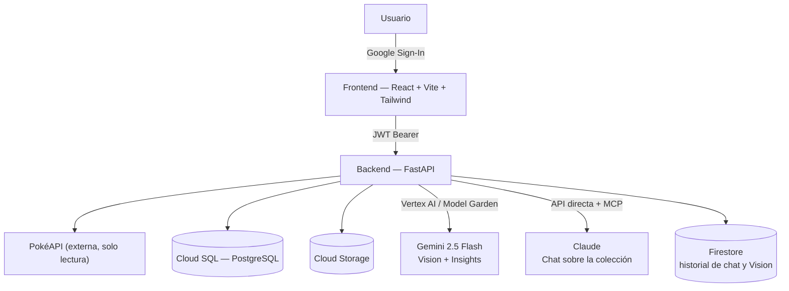

# PokéDex Manager

Aplicación web full-stack para gestionar una colección personal de Pokémon:
inicio de sesión con Google, exploración de la Pokédex completa (vía
PokéAPI), una colección propia con CRUD completo, y tres funcionalidades de
IA — identificar Pokémon por foto, chatear sobre la colección propia, e
insights del equipo actual.

**🔗 Instancia pública (GCP), lista para probar:**
[pokedex-manager-frontend-472849722290.us-central1.run.app/login](https://pokedex-manager-frontend-472849722290.us-central1.run.app/login)



Ver [`docs/ARCHITECTURE.md`](docs/ARCHITECTURE.md) para el diagrama completo
y las decisiones de diseño, y [`docs/POKEAPI_DECISION.md`](docs/POKEAPI_DECISION.md)
para cómo se resuelve la integración con la API externa.

## Stack

| Capa | Tecnología |
|---|---|
| Backend | FastAPI (Python 3.11+), SQLAlchemy 2.0, Alembic, `httpx` async |
| Frontend | React 18 + Vite + TypeScript, Tailwind CSS, TanStack Query, React Router |
| Base de datos | PostgreSQL (Cloud SQL en GCP / contenedor en local) |
| Auth | Google Identity Services (OAuth2/OIDC) + JWT propio de sesión |
| Almacenamiento de imágenes | Google Cloud Storage (o disco local en dev) |
| IA — Vision e Insights | Gemini 2.5 Flash vía **Vertex AI / Model Garden** (misma cuenta de servicio y facturación de GCP que el resto del proyecto) |
| IA — Chat sobre la colección | Claude (API directa de Anthropic), servidor **MCP** propio en memoria, `claude-haiku-4-5` por defecto |
| Historial de IA | Firestore (Native mode) — conversaciones del chat e identificaciones de Vision |
| Infra | Docker Compose (local) + scripts `.sh` para Cloud Run / Cloud SQL / GCS / Firestore (GCP) + Cloud Build CI/CD |

## Funcionalidades

### Core

- **Autenticación con registro obligatorio**: login y registro son endpoints
  separados. El login nunca crea usuarios — si la cuenta de Google no existe
  en la base de datos, el backend responde 404 y el frontend muestra un
  formulario de registro autocompletado (editable). Ver
  [`docs/ARCHITECTURE.md`](docs/ARCHITECTURE.md#4-autenticación--flujo-login-y-registro-separados).
- **Integración con PokéAPI**: búsqueda y listado paginado de Pokémon (solo
  lectura, catálogo externo), con caché en el backend — ver
  [`docs/POKEAPI_DECISION.md`](docs/POKEAPI_DECISION.md).
- **CRUD completo de la colección personal**: crear, leer, actualizar y
  borrar Pokémon (apodo, nivel, notas, favorito, imagen propia), y
  estadísticas agregadas (`/collection/stats`). Guía para probarlo con
  Postman: [`docs/POSTMAN_GUIDE.md`](docs/POSTMAN_GUIDE.md).
- **Interfaz responsive**: mobile-first, paleta pastel, tarjetas con tipos
  de Pokémon coloreados, spinner temático.

### Bonus (IA)

- **Identificar Pokémon por foto** (`/identificar`): sube una imagen y
  **Gemini 2.5 Flash** (Vertex AI) la identifica; tipos, ventajas/desventajas,
  peso, altura, habilidades y cadena evolutiva se resuelven contra PokéAPI
  para no depender de que el modelo "recuerde" datos duros.
- **Chat sobre tu colección** (`/chat`): **Claude** responde con acceso real
  a la colección del usuario vía un servidor **MCP** propio; soporta varias
  conversaciones por usuario (con títulos generados por IA) y guarda el
  historial en Firestore.
- **Insights de colección** (`/insights`): equipo ideal, fortalezas,
  debilidades y sugerencias generadas por Gemini 2.5 Flash a partir del
  equipo actual del usuario (hasta 6 Pokémon — por defecto los primeros que
  agregó, o los que elija a mano desde Mi Colección si tiene más de 6).

Ambas requieren un par de pasos manuales de configuración (crear la base de
Firestore y una API key de Anthropic) que **no** son necesarios para las
funciones core — ver [`docs/BONUS_FEATURES.md`](docs/BONUS_FEATURES.md) para
el detalle y las decisiones de arquitectura detrás de cada una.

## Probar la instancia desplegada

Todo el proyecto vive desplegado en Google Cloud Platform — no hace falta
instalar nada para evaluarlo:

**[pokedex-manager-frontend-472849722290.us-central1.run.app/login](https://pokedex-manager-frontend-472849722290.us-central1.run.app/login)**

Inicia sesión con cualquier cuenta de Google; si es la primera vez, se
completa un registro breve.

## Tests del backend

```bash
cd backend
python3 -m venv .venv && source .venv/bin/activate
pip install -r requirements.txt
pytest -q
```

Corre contra una base SQLite efímera (no necesita Cloud SQL ni ninguna
credencial de GCP/Anthropic — los servicios externos están mockeados).

## Replicar el despliegue en tu propio proyecto de GCP

1. Proyecto de GCP con facturación habilitada y `gcloud` autenticado.
2. Configura el OAuth consent screen: [Google Cloud Console → Credentials](https://console.cloud.google.com/apis/credentials)
   → "OAuth consent screen" (tipo External) → crea un **OAuth Client ID**
   de tipo **Web application** → en **Authorized JavaScript origins** agrega
   la URL de Cloud Run del frontend una vez desplegado → copia el Client ID
   (es `GOOGLE_CLIENT_ID` en el paso siguiente).
3. Corre los scripts de `infra/gcp/` en orden:

   ```bash
   cd infra/gcp
   export PROJECT_ID=tu-proyecto-gcp
   export GOOGLE_CLIENT_ID=xxxxx.apps.googleusercontent.com

   ./01-enable-apis.sh && ./02-service-accounts-iam.sh && ./03-cloud-sql.sh \
     && ./04-storage-bucket.sh && ./05-artifact-registry.sh && ./06-secrets.sh \
     && ./11-setup-firestore.sh && ./07-build-push.sh && ./08-deploy-backend.sh

   export BACKEND_URL=$(cat .last-backend-url)
   ./07-build-push.sh && ./09-deploy-frontend.sh
   ```

4. (Opcional) Activa el pipeline de CI/CD para que un `git push` a `main`
   dispare el build y el deploy solo — ver [`docs/CI_CD.md`](docs/CI_CD.md).
5. (Opcional) Configura las funcionalidades bonus de IA (Firestore + API key
   de Anthropic) — ver [`docs/BONUS_FEATURES.md`](docs/BONUS_FEATURES.md).

El detalle completo de cada script, qué recurso crea, y cómo actualizar un
despliegue ya existente está en [`docs/GCP_DEPLOYMENT.md`](docs/GCP_DEPLOYMENT.md).

## Estructura del repositorio

```
pokedex-manager/
├── backend/          # FastAPI — ver backend/app
├── frontend/          # React + Vite + Tailwind — ver frontend/src
├── infra/gcp/          # scripts .sh para aprovisionar y desplegar en GCP
├── docs/              # arquitectura, funcionalidades bonus, CI/CD, despliegue, Postman
├── cloudbuild.yaml    # pipeline de CI/CD (ver docs/CI_CD.md)
├── docker-compose.yml # entorno local: postgres + backend + frontend
└── .env.example
```

## Documentación

| Documento | Contenido |
|---|---|
| [`docs/ARCHITECTURE.md`](docs/ARCHITECTURE.md) | Decisiones de arquitectura, modelo de datos, flujo de autenticación |
| [`docs/BONUS_FEATURES.md`](docs/BONUS_FEATURES.md) | Cómo funcionan Vision, Chat MCP e Insights; configuración y troubleshooting |
| [`docs/POKEAPI_DECISION.md`](docs/POKEAPI_DECISION.md) | Por qué PokéAPI se consume como fuente externa en vez de replicarla |
| [`docs/GCP_DEPLOYMENT.md`](docs/GCP_DEPLOYMENT.md) | Qué crea cada script de `infra/gcp/`, orden de ejecución, reinicio de datos |
| [`docs/CI_CD.md`](docs/CI_CD.md) | Cómo funciona el pipeline de Cloud Build y su configuración |
| [`docs/POSTMAN_GUIDE.md`](docs/POSTMAN_GUIDE.md) | Probar la API (CRUD de colección y endpoints de IA) con Postman |

## Decisiones técnicas y trade-offs

- Se priorizó PostgreSQL (relacional) sobre Firestore para los datos core
  (usuario → colección → Pokémon), porque el dominio es naturalmente
  relacional; Firestore sí se usa, pero solo para el historial de IA
  (documentos semi-estructurados sin joins) — ver
  [`docs/ARCHITECTURE.md`](docs/ARCHITECTURE.md).
- La caché de PokéAPI es en memoria (TTL); en producción real se
  recomendaría Memorystore (Redis) compartido entre instancias de Cloud Run.
- La subida de imágenes tiene dos backends intercambiables (`local`/`gcs`)
  vía una variable de entorno, para poder desarrollar sin credenciales de
  GCP.
- El chat usa Claude Haiku 4.5 por defecto (no Sonnet 5) por costo,
  configurable con una sola variable de entorno sin tocar código — ver
  [`docs/BONUS_FEATURES.md`](docs/BONUS_FEATURES.md#modelos-usados).
- No se implementó refresh token / rotación de JWT (la sesión dura 24h);
  queda anotado como mejora futura.
