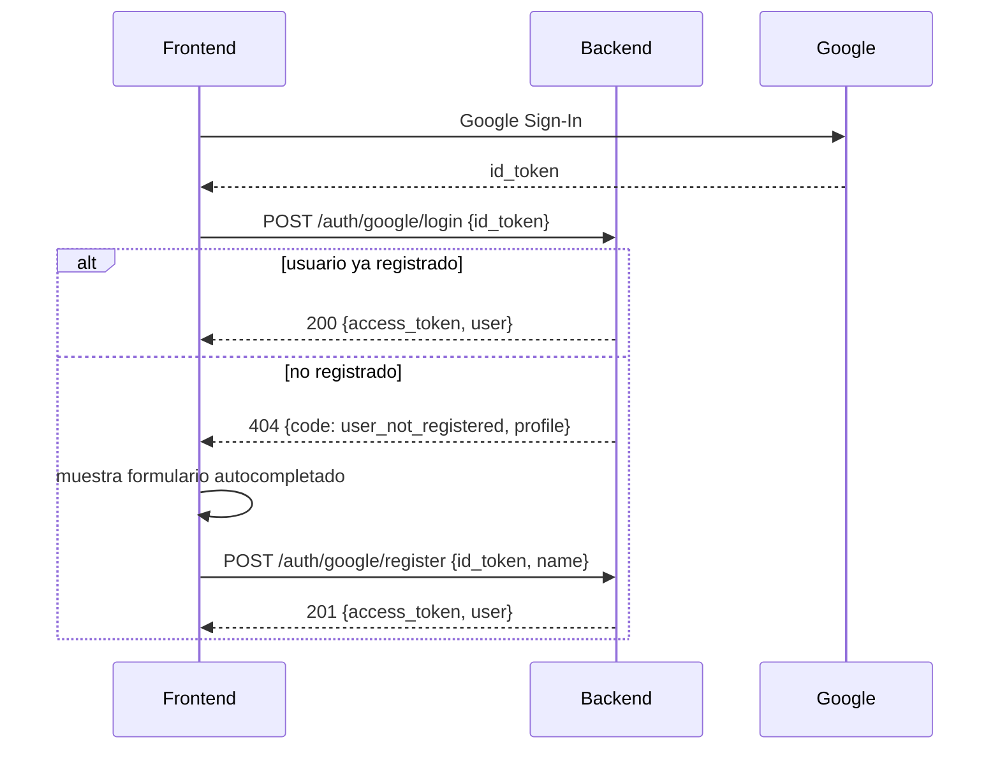

# Arquitectura — PokéDex Manager

## 1. Resumen

PokéDex Manager es una aplicación full-stack para gestionar una colección personal de
Pokémon. La arquitectura sigue la propuesta original (Cloud Run + Cloud SQL + Google
Sign-In + Vertex AI) pero **simplificada para un desarrollo de 3 días**, manteniendo el
estándar GCP para que escalar a los features bonus (LMMs, MCP, insights con IA) sea
un paso incremental y no un rediseño.

```mermaid
flowchart TD
    U["Usuario (Web / Mobile)"] -->|Google Sign-In / OAuth2| FE

    subgraph CloudRun["Google Cloud Run"]
        FE["Frontend<br/>React + Vite + Tailwind"]
        BE["Backend API<br/>FastAPI (Python 3.11+)"]
    end

    FE -->|HTTPS + JWT Bearer| BE
    BE -->|httpx async, cache| PA["PokéAPI (pokeapi.co)<br/>Catálogo público de Pokémon"]
    BE -->|SQLAlchemy + Cloud SQL Connector| DB[("Cloud SQL — PostgreSQL<br/>Usuarios + Colección")]
    BE -->|Signed URLs| GCS[("Cloud Storage Bucket<br/>Imágenes de cartas / capturas")]
    BE -.->|Fase 2 (bonus)| VX["Vertex AI / Gemini<br/>Vision, MCP, Insights"]

    style VX stroke-dasharray: 5 5
```

## 2. Decisiones clave y por qué

| Decisión | Alternativa considerada | Por qué se eligió |
|---|---|---|
| **FastAPI** (Python 3.11+) | Node/Express, Django | Async nativo, Pydantic para validación estricta, Swagger/OpenAPI autogenerado, se integra de forma natural con `google-auth`, `httpx` y los SDKs de Vertex AI para la Fase 2. |
| **React + Vite + Tailwind** | Next.js, Vue | Vite da un ciclo de desarrollo muy rápido para 3 días; Tailwind permite iterar el look pastel/responsive sin escribir CSS a mano; no necesitamos SSR (no hay requisito de SEO). |
| **Cloud SQL (PostgreSQL)** en vez de Firestore | Firestore | El dominio es relacional por naturaleza (usuarios 1‑N colección, cada entrada referencia un `pokemon_id` de un catálogo fijo). Un modelo relacional facilita filtros, agregaciones para los insights de la Fase 2 (conteo por tipo, etc.) y migraciones versionadas con Alembic. |
| **Cloud Storage para imágenes** | BLOB en la base de datos | Costo y rendimiento: la base solo guarda la URL (firmada o pública), nunca el binario. |
| **Google Sign-In (OAuth2 / OIDC)** | Auth propia con usuario/contraseña | Cumple "sistema de autenticación básico" sin reinventar manejo de contraseñas; el frontend obtiene un `id_token` de Google, el backend lo valida con `google-auth` y emite su propio JWT de sesión (para no atar toda request a Google). |
| **Alembic** para migraciones | `Base.metadata.create_all` | Buenas prácticas: control de versiones del esquema, reproducible en cualquier entorno (local, CI, Cloud SQL). |
| **Docker Compose para desarrollo local** | Solo instrucciones manuales | Un solo comando (`docker compose up`) levanta Postgres + backend + frontend; imprescindible porque el enunciado dice "no es necesario desplegar en producción". |
| **Scripts `.sh` (no Terraform)** | Terraform / Pulumi | El usuario pidió explícitamente `.sh`. Se documentan como scripts idempotentes y ordenados numéricamente; si el proyecto crece, migrar a Terraform es el siguiente paso natural (se menciona en `infra/gcp/README.md`). |

## 3. Estructura del monorepo

```
pokedex-manager/
├── backend/            # FastAPI + SQLAlchemy + Alembic
│   ├── app/
│   │   ├── core/       # config, seguridad (JWT, Google OIDC), logging
│   │   ├── db/         # engine/session, Base declarativa
│   │   ├── models/     # User, CollectionEntry (SQLAlchemy ORM)
│   │   ├── schemas/    # Pydantic (request/response)
│   │   ├── services/   # PokeAPIClient, StorageService (GCS)
│   │   └── api/v1/     # routers: auth, pokemon, collection
│   ├── migrations/     # Alembic
│   └── tests/
├── frontend/           # React + Vite + Tailwind + TanStack Query
│   └── src/
│       ├── api/        # cliente HTTP tipado
│       ├── context/    # AuthContext (JWT, usuario)
│       ├── components/ # Navbar, PokemonCard, TypeBadge, etc.
│       └── pages/      # Login, Pokédex, Mi Colección
├── infra/gcp/          # scripts .sh numerados para aprovisionar GCP
├── docs/               # este documento, decisión de PokéAPI, guía de despliegue
└── docker-compose.yml  # entorno local: postgres + backend + frontend
```

Separación de responsabilidades: el frontend nunca habla directamente con PokéAPI ni
con Cloud SQL — todo pasa por el backend, que es el único que conoce credenciales,
cachea llamadas externas y aplica reglas de negocio (por ejemplo, verificar que un
`pokemon_id` exista antes de guardarlo en la colección).

## 4. Autenticación — flujo (login y registro separados)

Login y registro son **dos endpoints distintos**, a propósito: el login nunca
da de alta usuarios. Solo entra a la app quien ya existe en la tabla `users`.

**Login** (`POST /api/v1/auth/google/login`):
1. El frontend usa el botón oficial de Google Identity Services y obtiene un `id_token` (JWT firmado por Google).
2. El frontend envía ese `id_token` al backend.
3. El backend lo valida contra los certificados públicos de Google (`google.oauth2.id_token.verify_oauth2_token`), verificando `aud` (Client ID) e `iss`.
4. Busca un usuario con ese `google_sub`. **Si no existe, responde `404`** con `code: "user_not_registered"` y el perfil de Google (nombre/email/foto) — nunca crea el usuario aquí.
5. Si existe, emite el JWT propio de sesión (HS256) y lo devuelve junto con los datos del usuario.

**Registro** (`POST /api/v1/auth/google/register`):
1. El frontend, al recibir el 404 anterior, muestra un formulario ya autocompletado con el perfil de Google (nombre editable, email de solo lectura).
2. Al confirmar, se reenvía el mismo `id_token` (se vuelve a validar contra Google, nunca se confía en datos sin firmar) junto con el nombre elegido.
3. Si el `google_sub` ya existe, responde `409 user_already_registered` (evita duplicados por doble clic).
4. Si no existe, crea el usuario y emite el JWT de sesión, igual que el login.



El JWT propio de sesión se guarda en el frontend y se envía como
`Authorization: Bearer <token>` en cada request subsiguiente. Esto evita
depender de Google en cada request y deja la puerta abierta a añadir más
proveedores de login en el futuro sin cambiar el resto del sistema.

## 5. Modelo de datos (v1)

```
users
  id (PK), google_sub (unique), email (unique), name, picture_url, created_at

collection_entries
  id (PK), user_id (FK -> users.id), pokemon_id (int, de PokéAPI),
  pokemon_name, sprite_url, types (JSON), nickname, level, is_favorite,
  notes, custom_image_url (GCS), caught_at, created_at, updated_at
```

`pokemon_id` / `pokemon_name` / `sprite_url` / `types` se guardan **desnormalizados**
(copiados desde PokéAPI al momento de agregar a la colección) para que la colección del
usuario siga siendo legible aunque PokéAPI esté caída o cambie datos — es una decisión
deliberada de resiliencia, no un descuido.

## 6. Roadmap de features bonus (Fase 2, fuera de alcance de esta entrega)

- **LMM / Vision**: endpoint `POST /api/v1/vision/analyze-card` que sube la imagen a GCS y la envía a Gemini con salida estructurada (JSON Schema) para autocompletar el formulario.
- **MCP**: servidor MCP en `backend/mcp_server/` que expone tools (`get_user_collection`, `get_pokemon_stats`) para un asistente conversacional.
- **Insights**: endpoint `GET /api/v1/insights` que agrega la colección (distribución de tipos, fortalezas/debilidades) y se lo pasa a Gemini para generar recomendaciones.

Estos puntos ya están reflejados en el diagrama (rama punteada a Vertex AI) para que la
integración no requiera romper la arquitectura actual.
