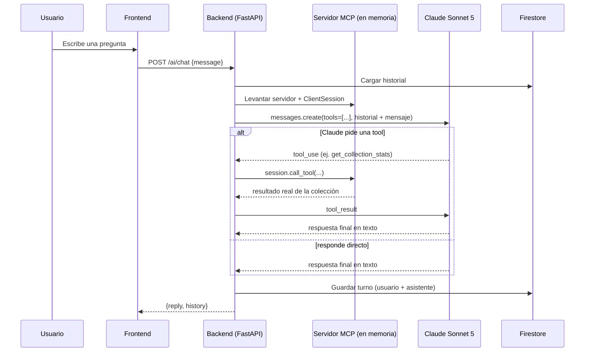

# Funcionalidades bonus de IA

Las tres funcionalidades bonus del enunciado están implementadas. Este documento
explica cómo funcionan, por qué se tomó cada decisión de arquitectura, y qué hay
que configurar a mano (nada de esto es necesario para las funciones core — sin
esta configuración, estos endpoints responden `503` con un mensaje claro, y el
resto de la app sigue funcionando normal).

## Resumen

| # | Feature | Modelo | Dónde vive |
|---|---|---|---|
| 1 | Identificar Pokémon por foto (Vision) | **Gemini 2.5 Flash** (Vertex AI / Model Garden) | `POST /api/v1/ai/vision/identify` |
| 2 | Chat sobre tu colección (MCP) | **Claude Sonnet 5** (API de Anthropic) | `POST /api/v1/ai/chat` |
| 3 | Insights de colección | **Gemini 2.5 Flash** (Vertex AI) | `GET /api/v1/ai/insights` |

## 1. Vision — identificar un Pokémon por foto

`POST /api/v1/ai/vision/identify` (multipart, campo `file`, requiere sesión).

Flujo:
1. La foto se sube a Cloud Storage (o disco en local) con el mismo
   `StorageService` que ya usan las imágenes de la colección.
2. Se le pide a **Gemini 2.5 Flash** (vía el SDK `google-genai`, apuntando a
   Vertex AI) que identifique el Pokémon y redacte una descripción + un fun
   fact, con salida JSON estructurada (`response_schema`) para no tener que
   parsear texto libre.
3. **Diseño importante**: no se le pide al modelo que "recuerde" la tabla de
   tipos de Pokémon (fuerte/débil contra qué) — eso puede alucinarlo. En vez de
   eso, el nombre que identificó Gemini se resuelve contra **PokéAPI** (la
   misma fuente de verdad que usa el resto de la app) y las ventajas/
   desventajas se calculan ahí con datos reales
   (`PokeAPIClient.get_type_matchups`). Si el modelo identificó algo que no
   existe tal cual en PokéAPI, se devuelve igual su descripción/fun fact, sin
   esos campos extra ni la opción de "agregar a mi colección" con un id
   oficial.

Por qué Vertex AI / Model Garden (y no la API pública de Gemini directamente):
mantiene todo dentro de la misma cuenta de servicio y facturación de GCP que ya
usa el resto del proyecto (Cloud Run, Cloud SQL, GCS) — un solo lugar donde
gestionar IAM y costos.

## 2. Chat MCP — Claude Sonnet 5 sobre tu colección

`POST /api/v1/ai/chat` (body `{"message": "..."}`, requiere sesión) · `GET` /
`DELETE /api/v1/ai/chat/history`.

### Por qué Anthropic directo (y no Claude vía Vertex AI Model Garden)

GCP también ofrece modelos Claude en su Model Garden, y se pudo haber usado esa
ruta para mantener todo "dentro de GCP" como en el punto 1. Se eligió la **API
directa de Anthropic** en su lugar porque MCP es el protocolo de Anthropic, y
la API directa es donde su soporte (incluidas las convenciones de `tool_use`
que se usan aquí) está más probado y documentado — la ruta más confiable para
esta funcionalidad específica. El costo de esa decisión: necesitas tu propia
API key de Anthropic (ver "Configuración" abajo), separada de tu facturación de
GCP — es el único paso manual de todo este bonus que no se puede resolver con
un script de `gcloud`.

### Cómo funciona el servidor MCP

No hay un proceso ni un contenedor MCP aparte — sería infraestructura extra
sin necesidad real para esta app. En su lugar, **por cada mensaje de chat**:

1. Se construye un servidor MCP (`FastMCP`, del SDK oficial `mcp`) con tools
   ya "cerradas" sobre el usuario que está chateando y la sesión de base de
   datos de ESE request: `list_my_collection`, `get_collection_stats`,
   `get_pokemon_info`. El servidor literalmente no puede leer la colección de
   otro usuario — ni el modelo puede pedírselo pasándole un id, porque las
   tools no reciben `user_id` como parámetro.
2. Se conecta un `ClientSession` MCP real a ese servidor con streams **en
   memoria** (`mcp.shared.memory`, el mismo mecanismo que usa el propio SDK de
   `mcp` en sus tests) — mismo protocolo JSON-RPC de MCP, sin la capa de
   transporte de red que tendría un servidor MCP standalone (stdio o HTTP).
3. Se listan las tools del servidor y se traducen al formato de `tools` de la
   API de Claude.
4. Se llama a Claude con el historial (cargado de Firestore) + el mensaje
   nuevo. Si responde con `tool_use`, la tool se ejecuta a través del
   `ClientSession` MCP (no se llama directo a una función de Python) y su
   resultado se le devuelve a Claude como `tool_result`; esto se repite hasta
   que responde con texto final (tope de 5 iteraciones).
5. El turno completo se guarda en Firestore.



### Por qué Firestore para el historial

Es la opción serverless natural de GCP para este dato: documentos de tamaño
variable, sin necesidad de joins ni transacciones complejas, cero
administración (a diferencia de añadir esto a Cloud SQL, no hay que migrar un
esquema para "una conversación que crece"). Un documento por usuario en la
colección `mcp_conversations`, con el array completo de mensajes — para el
volumen de un chat personal esto es más simple que paginar una subcolección.
Esto no contradice la decisión de usar Cloud SQL para los datos core (ver
`docs/ARCHITECTURE.md`): son dos tipos de dato distintos.

## 3. Insights de colección

`GET /api/v1/ai/insights` (requiere sesión y al menos 1 Pokémon en tu
colección).

Se le manda a Gemini 2.5 Flash un resumen de tu colección actual (nombres,
tipos, apodos, favoritos, niveles) y se le pide, con salida JSON estructurada:
un equipo ideal de hasta 6 Pokémon (mezclando los que ya tienes con
sugerencias nuevas), fortalezas y debilidades de tipo, fun facts, y
alternativas para agregar.

## Configuración (una sola vez)

### A. Vertex AI / Gemini (Vision + Insights) — ya viene listo si desplegaste con los scripts de `infra/gcp/`

`aiplatform.googleapis.com` y el rol `roles/aiplatform.user` para la service
account de runtime ya estaban en `01-enable-apis.sh` / `02-service-accounts-iam.sh`
desde la primera entrega (se dejaron preparados a propósito). Si corriste esos
scripts, no falta nada — el backend en Cloud Run resuelve las credenciales
automáticamente (ADC del propio servicio). Para correrlo en **local**, necesitas:

```bash
gcloud auth application-default login
# y en tu .env:
GOOGLE_CLOUD_PROJECT=tu-proyecto-gcp
```

### B. Firestore (historial del chat) — un script nuevo, una sola vez

```bash
cd infra/gcp
export PROJECT_ID=tu-proyecto-gcp
./11-setup-firestore.sh
```

Crea la base de datos Firestore en modo Native para el proyecto (es una base
por proyecto, no algo que se "despliega" por servicio). Si ya la tenías creada
de antes, el script no hace nada.

### C. Anthropic API key (chat MCP) — el único paso 100% manual

1. Crea una cuenta y una API key en
   [console.anthropic.com/settings/keys](https://console.anthropic.com/settings/keys)
   (facturación separada de GCP).
2. Guárdala en Secret Manager:
   ```bash
   cd infra/gcp
   export PROJECT_ID=tu-proyecto-gcp
   export ANTHROPIC_API_KEY=sk-ant-...
   ./06-secrets.sh
   ```
3. Vuelve a desplegar el backend (`./08-deploy-backend.sh`, o si usas CI/CD,
   agrega la sustitución `_SECRET_ANTHROPIC_API_KEY` al trigger si aún no
   existe — ver `docs/CI_CD.md` — y haz push) para que recoja el secreto nuevo.

Sin este paso, todo lo demás de la app (incluidos Vision e Insights) funciona
igual; solo `/ai/chat` responde `503` hasta que exista el secreto.

## Modelos usados (y cómo verificarlos si cambian)

- Vision e Insights: `gemini-2.5-flash` (configurable vía `GEMINI_MODEL`).
- Chat: `claude-sonnet-5` (configurable vía `ANTHROPIC_MODEL`) — es el modelo
  vigente al momento de esta entrega; si Anthropic publica una versión más
  nueva y quieres usarla, solo cambia esta variable de entorno (no hace falta
  tocar código). La lista de modelos vigentes siempre está en
  [platform.claude.com/docs/en/about-claude/models/model-ids-and-versions](https://platform.claude.com/docs/en/about-claude/models/model-ids-and-versions).

## Probar estos endpoints con Postman

Los tres requieren el mismo Bearer token que el resto de la API (ver
`docs/POSTMAN_GUIDE.md`, paso 1). Diferencias a tener en cuenta:

- `POST /ai/vision/identify` — Body → **form-data**, key `file` tipo **File**
  (igual que `/collection/<id>/image`), no JSON.
- `POST /ai/chat` — Body raw JSON `{"message": "¿qué pokémon tengo?"}`. Puede
  tardar varios segundos (dos idas y vueltas: Claude → tool → Claude).
- `GET /ai/insights` — sin body; agrega antes al menos un Pokémon a tu
  colección o responde `422`.
