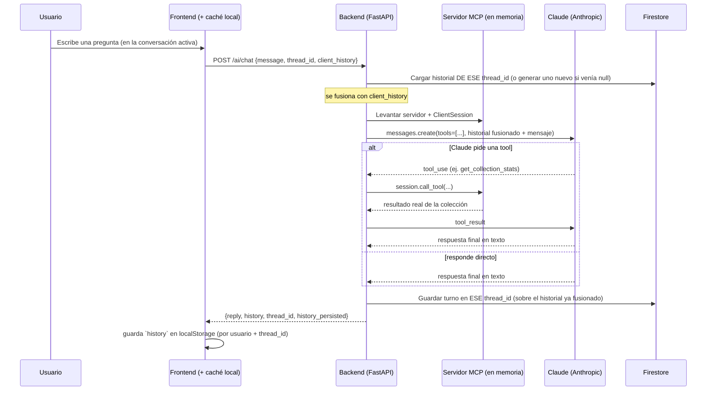

# Funcionalidades bonus de IA

Las tres funcionalidades bonus del enunciado están implementadas. Este documento
explica cómo funcionan, por qué se tomó cada decisión de arquitectura, y qué hay
que configurar a mano (nada de esto es necesario para las funciones core — sin
esta configuración, estos endpoints responden `503` con un mensaje claro, y el
resto de la app sigue funcionando normal).

## Resumen

| # | Feature | Modelo | Dónde vive |
|---|---|---|---|
| 1 | Identificar Pokémon por foto (Vision) | **Gemini 2.5 Flash** (Vertex AI / Model Garden) | `POST /api/v1/ai/vision/identify` |
| 2 | Chat sobre tu colección (MCP) | **Claude** (API de Anthropic) — `claude-haiku-4-5` por defecto, configurable a `claude-sonnet-5` | `POST /api/v1/ai/chat` |
| 3 | Insights de colección | **Gemini 2.5 Flash** (Vertex AI) | `GET /api/v1/ai/insights` |

## 1. Vision — identificar un Pokémon por foto

`POST /api/v1/ai/vision/identify` (multipart, campo `file`, requiere sesión) ·
`GET /api/v1/ai/vision/history` (historial de consultas pasadas, más reciente
primero, incluida la foto que subiste cada vez).

Flujo:
1. La foto se sube a Cloud Storage (o disco en local) con el mismo
   `StorageService` que ya usan las imágenes de la colección.
2. Se le pide a **Gemini 2.5 Flash** (vía el SDK `google-genai`, apuntando a
   Vertex AI) que identifique el Pokémon y redacte una descripción + un
   estimado de en qué juego apareció por primera vez y en qué zonas es fácil
   encontrarlo, con salida JSON estructurada (`response_schema`) para no
   tener que parsear texto libre.
3. **Diseño importante**: no se le pide al modelo que "recuerde" datos duros
   de la Pokédex (tabla de tipos, generación de debut, hábitat, peso, altura,
   habilidades, cadena evolutiva) — eso puede alucinarlo. En vez de eso, el
   nombre que identificó Gemini se resuelve contra **PokéAPI** (la misma
   fuente de verdad que usa el resto de la app) y ahí se calculan/consultan
   con datos reales:
   - Fuerte/débil contra qué tipo (`PokeAPIClient.get_type_matchups`), además
     traducido a español (`translate_types_es`) para mostrarlo en la tabla.
   - Juego de primera aparición y zonas donde es fácil encontrarlo
     (`PokeAPIClient.get_species_info`, contra `/pokemon-species/{id}` de
     PokéAPI: campos `generation` y `habitat`, con un mapeo fijo a nombres de
     juego/zona en español). El estimado del modelo se usa solo como
     respaldo si el nombre identificado no se pudo resolver contra PokéAPI.
   - Peso y altura (`/pokemon/{id}`, convertidos a kg/metros — PokéAPI los da
     en hectogramos/decímetros) y habilidades (mismo endpoint).
   - Pre-evolución y evoluciones directas
     (`PokeAPIClient.get_evolution_info`, contra `/evolution-chain/{id}` —
     recorre el árbol de la cadena evolutiva completa, que puede ramificarse
     como en Eevee, buscando el nodo del Pokémon identificado).
   Si el modelo identificó algo que no existe tal cual en PokéAPI, se
   devuelve igual su descripción/estimados, sin esos campos extra ni la
   opción de "agregar a mi colección" con un id oficial.
4. La consulta completa (con la foto) se guarda en el historial de Vision del
   usuario en Firestore (colección `vision_history`, un documento por usuario
   con las últimas 50 consultas) — **best effort**: si Firestore falla, la
   identificación ya se le mostró al usuario de todos modos con
   `history_persisted: false`, simplemente no queda guardada para verla
   después. El frontend, además, guarda cada identificación en
   `localStorage` (`utils/visionHistoryCache.ts`), un caché por cuenta de
   usuario, y lo mezcla con lo que devuelve el backend (por `entry_id`) cada
   vez que se carga la página — así el historial se sigue viendo completo
   sin importar a qué otra sección de la app navegue el usuario o si recarga
   la página, aunque el guardado en Firestore esté fallando (ver la sección
   de troubleshooting del chat más abajo — es el mismo permiso de IAM,
   `roles/datastore.user`, el que cubre ambas colecciones de Firestore). El
   caché de `localStorage` es solo un respaldo del lado del cliente: cuando
   Firestore sí responde, esa es la fuente de verdad y el caché se
   "autocura" con ella.

Por qué Vertex AI / Model Garden (y no la API pública de Gemini directamente):
mantiene todo dentro de la misma cuenta de servicio y facturación de GCP que ya
usa el resto del proyecto (Cloud Run, Cloud SQL, GCS) — un solo lugar donde
gestionar IAM y costos.

En el frontend, el resultado recién identificado se muestra primero como una
tarjeta con todo el detalle (foto, nombre, tipo, descripción, peso, altura,
habilidades, pre-evolución/evoluciones, juego de primera aparición, zonas
donde es fácil encontrarlo, fuerte/débil contra en español) y el botón de
agregar a la colección; debajo, el historial completo (`VisionIdentifyPage.tsx`)
se muestra como una tabla con esas mismas columnas.

### Por qué el aviso "no guardado" se quedaba pegado para siempre

Bug real reportado: el aviso "⚠️ no guardado" (`history_persisted: false`)
aparecía en una fila del historial y ya no se quitaba nunca — ni cerrando
sesión y volviendo a entrar. **Esto era un bug de frontend, no reflejaba un
fallo real y continuo de Firestore.**

La causa: `VisionIdentifyPage.tsx` fusiona el historial guardado en
`localStorage` (respaldo local) con el que devuelve el backend
(`mergeHistory`), y en un empate (misma consulta, mismo `entry_id`) la
función se queda con el PRIMER arreglo que recibe. La llamada original era
`mergeHistory(cachéLocal, servidor)` — es decir, la copia local siempre
ganaba. Si en el momento de identificar un Pokémon el guardado en Firestore
falló (y por eso esa entrada quedó en localStorage con
`history_persisted: false`), esa bandera quedaba fija ahí para siempre: aun
cuando Firestore se recuperara y esa misma consulta ya existiera del lado
del servidor con `history_persisted: true`, la copia local vieja seguía
ganando el "empate" y el usuario nunca dejaba de ver el aviso — cerrar sesión
tampoco ayudaba porque el caché de `localStorage` sobrevive entre sesiones (a
propósito, es el respaldo).

**El fix:** se invirtió el orden — ahora se llama `mergeHistory(servidor,
cachéLocal)`, así que si la misma consulta existe en ambos lados, gana
siempre la versión que confirmó el servidor (Firestore, la fuente de verdad),
y la copia local solo se usa para lo que el servidor todavía no tiene. Con
esto, cualquier entrada vieja con la bandera mal puesta se corrige sola la
próxima vez que se cargue el historial y Firestore ya tenga la versión
correcta — no hace falta ninguna acción manual ni migrar datos existentes.

Dicho esto: si una fila *sigue* mostrando el aviso después de este fix, esa
sí es una señal real de que el guardado de ESA consulta en particular nunca
llegó a Firestore (revisar el mismo checklist de permisos de IAM que la
sección de troubleshooting del chat, arriba) — la diferencia es que ahora el
aviso refleja el estado real, en vez de un dato viejo atorado en el navegador.

## 2. Chat MCP — Claude sobre tu colección

`POST /api/v1/ai/chat` (body `{"message": "...", "thread_id": "..." | null,
"client_history": [...]}`, requiere sesión) para hablar con la IA, más un
CRUD chico de **conversaciones** (varias por usuario, no solo una):

- `GET /api/v1/ai/chat/threads` — todas tus conversaciones (id, título,
  fecha, cantidad de mensajes), más reciente primero.
- `POST /api/v1/ai/chat/threads` — "Iniciar nueva conversación": crea una
  vacía y devuelve su id.
- `GET /api/v1/ai/chat/threads/{id}` — mensajes de una conversación puntual.
- `DELETE /api/v1/ai/chat/threads/{id}` — borra una conversación (las demás
  quedan intactas).

### Por qué Anthropic directo (y no Claude vía Vertex AI Model Garden)

GCP también ofrece modelos Claude en su Model Garden, y se pudo haber usado esa
ruta para mantener todo "dentro de GCP" como en el punto 1. Se eligió la **API
directa de Anthropic** en su lugar porque MCP es el protocolo de Anthropic, y
la API directa es donde su soporte (incluidas las convenciones de `tool_use`
que se usan aquí) está más probado y documentado — la ruta más confiable para
esta funcionalidad específica. El costo de esa decisión: necesitas tu propia
API key de Anthropic (ver "Configuración" abajo), separada de tu facturación de
GCP — es el único paso manual de todo este bonus que no se puede resolver con
un script de `gcloud`.

### Cómo funciona el servidor MCP

No hay un proceso ni un contenedor MCP aparte — sería infraestructura extra
sin necesidad real para esta app. En su lugar, **por cada mensaje de chat**:

1. Se construye un servidor MCP (`FastMCP`, del SDK oficial `mcp`) con tools
   ya "cerradas" sobre el usuario que está chateando y la sesión de base de
   datos de ESE request: `list_my_collection`, `get_collection_stats`,
   `get_pokemon_info`. El servidor literalmente no puede leer la colección de
   otro usuario — ni el modelo puede pedírselo pasándole un id, porque las
   tools no reciben `user_id` como parámetro.
2. Se conecta un `ClientSession` MCP real a ese servidor con streams **en
   memoria** (`mcp.shared.memory`, el mismo mecanismo que usa el propio SDK de
   `mcp` en sus tests) — mismo protocolo JSON-RPC de MCP, sin la capa de
   transporte de red que tendría un servidor MCP standalone (stdio o HTTP).
3. Se listan las tools del servidor y se traducen al formato de `tools` de la
   API de Claude.
4. Se llama a Claude con el historial DE ESA CONVERSACIÓN (`thread_id`) + el
   mensaje nuevo. Ese historial NO sale solo de Firestore: se fusiona
   (`chat.py`, `_merge_history`) con `client_history`, la copia local que
   manda el frontend en cada request (`utils/chatHistoryCache.ts`, guardada
   en `localStorage` por cuenta de usuario Y por conversación) — así, si el
   guardado en Firestore ha estado fallando, Claude sigue teniendo el
   contexto real de la conversación en vez de "olvidarlo" en cada mensaje
   nuevo. Si `thread_id` viene `null` (usuario sin ninguna conversación
   todavía), se genera uno nuevo aquí mismo y se devuelve en la respuesta —
   el frontend lo adopta como la conversación activa. Si Claude responde con
   `tool_use`, la tool se ejecuta a través del `ClientSession` MCP (no se
   llama directo a una función de Python) y su resultado se le devuelve a
   Claude como `tool_result`; esto se repite hasta que responde con texto
   final (tope de 5 iteraciones).
5. El turno completo se guarda en Firestore, EN ESA CONVERSACIÓN, usando como
   base la versión ya fusionada del punto anterior (no lo que Firestore tenía
   guardado antes) — así el documento se "autocura" con la versión más
   completa disponible en vez de perpetuar un hueco de mensajes perdidos. Es
   **best effort**: si Firestore falla (por ejemplo, un problema de
   permisos), Claude ya respondió correctamente y esa respuesta se le
   entrega igual al usuario (`history_persisted: false` en la respuesta),
   solo no queda guardada del lado del servidor — el frontend sigue viéndola
   igual, porque ya la tiene en su copia local.

### Varias conversaciones por usuario ("Iniciar nueva conversación")

Al usuario le hacía falta poder "hablar de otra cosa" con Claude sin perder
el hilo anterior, y poder ver y retomar cualquier conversación pasada — antes
solo existía UNA conversación por usuario (un solo documento en Firestore, un
solo botón "Reiniciar conversación" que la borraba por completo). Ahora:

- Firestore guarda, por usuario, un **dict de conversaciones**
  (`threads: {thread_id: {title, messages, created_at, updated_at}}`) en vez
  de un solo array `messages` — sigue siendo un único documento por usuario
  (mismo razonamiento de simplicidad de siempre: para el volumen de un chat
  personal, ni siquiera varias conversaciones justifican una subcolección
  aparte con su propio paginado).
- El título de cada conversación se deriva del primer mensaje del usuario en
  ella (recortado a 40 caracteres) — evita gastar otra llamada al modelo solo
  para "resumir en un título".
- El frontend (`PokedexChatPage.tsx`) muestra la lista de conversaciones a un
  costado, con un botón "➕ Iniciar nueva conversación" arriba; hacer clic en
  cualquiera de la lista la vuelve la conversación activa y carga sus
  mensajes (con el mismo patrón de caché local + fusión con el servidor que
  ya existía, ahora con una entrada de `localStorage` por conversación en vez
  de una sola por usuario).
- Borrar una conversación (🗑️ en la lista) solo la quita a ELLA — las demás
  quedan intactas, a diferencia del viejo "Reiniciar conversación" que
  borraba la única que existía.



### Solución de problemas — "el chat no funciona"

Si `/ai/chat` responde 503, el mensaje de error (`detail`) ahora incluye la
causa real, no un mensaje genérico — tres bugs que se corrigieron:

**1. `"unhandled errors in a TaskGroup (1 sub-exception)"` no decía nada.**
`create_connected_server_and_client_session` corre el servidor y el cliente
MCP dentro de un `anyio.TaskGroup`, y desde Python 3.11 cualquier excepción
que salga de ese bloque llega envuelta en un `ExceptionGroup` — sin
desenvolverla, se pierde el mensaje real. `chat.py` ahora se desenvuelve
recursivamente (`_root_cause`) antes de loguearla y devolverla en el
`detail` del 503.

**2. La causa real que ese desenvolvimiento reveló: `"'ThinkingBlock' object
has no attribute 'id'"`.** Al reconstruir a mano el turno del asistente para
reenviárselo a Claude en cada vuelta del loop de tools, el código asumía que
la respuesta solo traía bloques `"text"` y `"tool_use"` — pero Claude Sonnet
5 a veces incluye también un bloque `"thinking"` (razonamiento) junto con el
`tool_use`, y ese `ThinkingBlock` no tiene atributo `.id` (que sí tienen los
bloques de tipo `tool_use`). Esto reventaba justo dentro del `async with` de
la sesión MCP, por eso llegaba envuelto en el `ExceptionGroup` del punto 1 —
los dos bugs se enmascaraban entre sí. El fix real: en vez de reconstruir
cada bloque a mano enumerando tipos, `chat.py` ahora usa
`block.model_dump(exclude_none=True)`, que serializa cualquier tipo de
bloque (texto, tool_use, thinking, y los que Anthropic agregue después)
correctamente sin tener que anticiparlos todos. Hay un test de regresión
específico para esto (`test_run_pokedex_chat_handles_thinking_blocks`).

**3. Un fallo de Firestore tumbaba TODA la respuesta, aunque Claude sí
hubiera respondido bien.** Antes, si el chat funcionaba pero SOLO fallaba el
guardado en Firestore (por ejemplo, el 403 de permisos de abajo), el
endpoint completo respondía 503 igual, descartando la respuesta ya generada.
Ahora ese guardado es "best effort": la respuesta se entrega siempre que
Claude haya respondido, con `history_persisted: false` si no se pudo
guardar (el frontend muestra un aviso pequeño, no bloqueante).

**4. El aviso "⚠️ no guardado" de Vision se quedaba pegado para siempre,
incluso cerrando sesión.** Este era un bug real de FRONTEND, no de
Firestore — ver la sección de Vision más abajo ("Por qué el aviso 'no
guardado' se quedaba pegado") para el detalle completo.

Si ves el error de Firestore específicamente
(`Firestore no disponible... 403 Missing or insufficient permissions`),
revisa en orden:

1. **¿La revisión desplegada usa la service account correcta?**
   ```bash
   gcloud run services describe pokedex-manager-backend \
     --project=tu-proyecto-gcp --region=us-central1 \
     --format="value(spec.template.spec.serviceAccountName)"
   ```
   Debe imprimir `pokedex-manager-runtime@tu-proyecto-gcp.iam.gserviceaccount.com`.
   Si sale otra cosa (o la cuenta de compute por defecto), vuelve a correr
   `./08-deploy-backend.sh` — el script siempre pasa `--service-account`.

2. **¿El rol realmente está asignado?**
   ```bash
   gcloud projects get-iam-policy tu-proyecto-gcp \
     --flatten="bindings[].members" \
     --filter="bindings.role:roles/datastore.user" \
     --format="table(bindings.role,bindings.members)"
   ```
   Debe aparecer la service account de runtime. Si no sale, vuelve a correr
   `./02-service-accounts-iam.sh` (es idempotente).

3. **Espera la propagación de IAM.** Un `add-iam-policy-binding` recién
   aplicado puede tardar unos minutos en propagarse — si acabas de correr el
   paso 2, espera ~5 minutos y prueba de nuevo antes de seguir investigando.

4. **¿Existe la base de Firestore?**
   ```bash
   gcloud firestore databases list --project=tu-proyecto-gcp
   ```
   Debe listar `(default)` con `type: FIRESTORE_NATIVE`. Si no existe, corre
   `./11-setup-firestore.sh`.

5. Si con todo eso sigue el 403, revisa los logs del backend en Cloud Run
   (Cloud Console → Logging, o `gcloud run services logs read
   pokedex-manager-backend --region=us-central1 --limit=50`) — el traceback
   completo de `google.api_core` (con el mensaje de error exacto) queda ahí,
   aunque el mensaje que ve el usuario en la app sea más corto.

### Por qué Firestore para el historial

Es la opción serverless natural de GCP para este dato: documentos de tamaño
variable, sin necesidad de joins ni transacciones complejas, cero
administración (a diferencia de añadir esto a Cloud SQL, no hay que migrar un
esquema para "una conversación que crece"). Un documento por usuario en la
colección `mcp_conversations`, con un dict `threads: {thread_id: {title,
messages, created_at, updated_at}}` — una entrada por conversación — en vez
del array único `messages` de la primera versión (que solo soportaba una
conversación por usuario). Sigue siendo un solo documento por usuario (no una
subcolección `threads/{id}` aparte): para el volumen de un chat personal esto
es más simple que paginar, y evita administrar una subcolección extra.
Esto no contradice la decisión de usar Cloud SQL para los datos core (ver
`docs/ARCHITECTURE.md`): son dos tipos de dato distintos.

Por el mismo motivo (documento semi-estructurado que crece con el tiempo, sin
joins), el historial de Vision (punto 1) reutiliza el mismo patrón en una
colección separada: `vision_history`, un documento por usuario con sus
últimas 50 consultas (incluida la foto de cada una).

## 3. Insights de colección

`GET /api/v1/ai/insights` (requiere sesión y al menos 1 Pokémon en tu
colección).

El análisis se basa **siempre en los primeros 6 Pokémon** que agregaste a tu
colección (en el orden en que los agregaste), aunque tengas más — el
endpoint los ordena por fecha de creación y recorta a 6 antes de llamar al
modelo. A Gemini 2.5 Flash se le manda ese resumen (nombres, tipos, apodos,
favoritos, niveles) y se le pide, con salida JSON estructurada:

- Un puntaje de 1 a 10 de qué tan bueno es ESE equipo de 6 (con motivo
  específico) — se muestra en el frontend como una fila de 10 pokébolas,
  tantas "llenas" como el puntaje.
- Fortalezas y debilidades específicas de esos 6 Pokémon (el prompt le pide
  explícitamente mencionarlos por nombre, no generalidades).
- Un equipo ideal de hasta 6 Pokémon, mezclando los que ya tienes
  (`already_in_collection: true`) con sugerencias nuevas — el frontend
  resalta en **naranja pastel** las que no tienes, con la razón de por qué
  te convendrían.
- 2 alternativas por cada puesto del equipo ideal, por si prefieres cambiar
  a alguno de los recomendados por otro Pokémon con un rol similar.
- Datos curiosos sobre los Pokémon de tu colección.

Los nombres que menciona el modelo (equipo ideal, alternativas, datos
curiosos) se resuelven contra PokéAPI para conseguir su sprite real — mismo
principio que Vision: nunca se le pide al modelo una URL de imagen, solo un
nombre, y la imagen sale de la fuente de verdad. El "equipo analizado" (tus
primeros 6) ni siquiera se resuelve: sale directo de tu colección en la base
de datos, así que sus imágenes son siempre exactas.

### Bug real corregido: Insights (y otras páginas) mostraban datos de OTRA cuenta

Bug reportado, con capturas: al cambiar de cuenta en el mismo navegador (sin
cerrar la pestaña), la sección de Insights mostraba el análisis de la cuenta
ANTERIOR — un Pokémon que la cuenta nueva ni siquiera tiene en su colección.

**Causa real:** el backend siempre respondió correctamente por cuenta (esto
nunca fue un bug de datos ni de permisos); el problema estaba enteramente en
el frontend, en cómo React Query cachea las respuestas. Cada `useQuery` cachea
por su `queryKey`, y la key de Insights era simplemente `["ai", "insights"]`
— sin ningún identificador de la cuenta. Como las dos cuentas de prueba
comparten la misma pestaña/sesión del navegador, ambas terminaban leyendo (y
escribiendo) la MISMA entrada de caché: la cuenta nueva podía ver, aunque
fuera brevemente, la respuesta que había quedado cacheada de la cuenta
anterior. Se auditó el resto de la app y se encontró la misma clase de bug
(key sin id de usuario) en el historial de Vision, el historial/hilos del
chat, y las páginas de colección/Pokédex.

**El fix, en dos capas:**

1. **La corrección real:** toda `queryKey` que depende de la cuenta que tiene
   la sesión iniciada ahora incluye `user?.id` — `["ai", "insights",
   user.id]`, `["ai", "vision-history", user.id]`, `["ai", "chat-threads",
   user.id]`, `["collection", user.id]`, etc. Con el id en la key, cada
   cuenta tiene su propia entrada de caché — nunca pueden compartir ni
   "heredar" una de la otra, sin importar en qué orden se inicie sesión.
2. **Defensa adicional:** `AuthContext.tsx` ahora llama a
   `queryClient.clear()` al cerrar sesión (`logout()`), que vacía TODO el
   caché de React Query — así, aunque en el futuro se agregue una query
   nueva y alguien olvide escoparla por usuario, cerrar sesión sigue
   garantizando que ninguna respuesta de la cuenta anterior sobreviva a la
   siguiente que inicie sesión en esa misma pestaña.

Hay un test de backend nuevo (`test_chat_threads_are_isolated_between_users`)
que confirma que el backend, por su parte, nunca mezcla datos entre cuentas —
la fuga estaba solo en el caché del frontend, no en el API.

## Configuración (una sola vez)

### A. Vertex AI / Gemini (Vision + Insights) — ya viene listo si desplegaste con los scripts de `infra/gcp/`

`aiplatform.googleapis.com` y el rol `roles/aiplatform.user` para la service
account de runtime ya estaban en `01-enable-apis.sh` / `02-service-accounts-iam.sh`
desde la primera entrega (se dejaron preparados a propósito). Si corriste esos
scripts, no falta nada — el backend en Cloud Run resuelve las credenciales
automáticamente (ADC del propio servicio). Para correrlo en **local**, necesitas:

```bash
gcloud auth application-default login
# y en tu .env:
GOOGLE_CLOUD_PROJECT=tu-proyecto-gcp
```

### B. Firestore (historial del chat) — un script nuevo, una sola vez

```bash
cd infra/gcp
export PROJECT_ID=tu-proyecto-gcp
./11-setup-firestore.sh
```

Crea la base de datos Firestore en modo Native para el proyecto (es una base
por proyecto, no algo que se "despliega" por servicio). Si ya la tenías creada
de antes, el script no hace nada.

### C. Anthropic API key (chat MCP) — el único paso 100% manual

1. Crea una cuenta y una API key en
   [console.anthropic.com/settings/keys](https://console.anthropic.com/settings/keys)
   (facturación separada de GCP).
2. Guárdala en Secret Manager:
   ```bash
   cd infra/gcp
   export PROJECT_ID=tu-proyecto-gcp
   export ANTHROPIC_API_KEY=sk-ant-...
   ./06-secrets.sh
   ```
3. Vuelve a desplegar el backend (`./08-deploy-backend.sh`, o si usas CI/CD,
   agrega la sustitución `_SECRET_ANTHROPIC_API_KEY` al trigger si aún no
   existe — ver `docs/CI_CD.md` — y haz push) para que recoja el secreto nuevo.

Sin este paso, todo lo demás de la app (incluidos Vision e Insights) funciona
igual; solo `/ai/chat` responde `503` hasta que exista el secreto.

## Modelos usados (y cómo verificarlos si cambian)

- Vision e Insights: `gemini-2.5-flash` (configurable vía `GEMINI_MODEL`) —
  facturado por Vertex AI/GCP, no por una API key de Gemini (ver el punto
  "¿Dónde se factura Gemini?" más abajo).
- Chat: `claude-haiku-4-5-20251001` por defecto (configurable vía
  `ANTHROPIC_MODEL`). Se eligió Haiku 4.5 en vez de Sonnet 5 a propósito por
  costo: al momento de esta entrega, Haiku 4.5 cuesta **$1 / $5 por millón
  de tokens de entrada/salida**, contra **$2 / $10** de Sonnet 5 — 5 veces
  más barato en entrada, 2 veces en salida — y soporta tool use (MCP) igual
  de bien para una colección personal de este tamaño; su contexto (200K
  tokens) sobra para esta app. Si el enunciado de tu entrega exige
  específicamente "Claude Sonnet 5" y quieres someterlo con ese modelo,
  cambia esta única variable de entorno a `claude-sonnet-5` (no hace falta
  tocar código, ni en local ni en Cloud Run/Secret Manager) — puedes usar
  Haiku 4.5 para desarrollar y probar sin gastar tanta cuota, y volver a
  Sonnet 5 solo para la entrega final si hace falta. La lista de modelos
  vigentes y sus precios siempre está en
  [platform.claude.com/docs/en/about-claude/models/model-ids-and-versions](https://platform.claude.com/docs/en/about-claude/models/model-ids-and-versions)
  y en [claude.com/pricing](https://claude.com/pricing).

### ¿Dónde se factura Gemini 2.5 Flash si no hay una API key de Gemini?

Vision e Insights usan **Vertex AI** (Model Garden), no la API pública de
Gemini (la de [aistudio.google.com](https://aistudio.google.com), que sí usa
una API key tipo `AIzaSy...`) — por diseño, para mantener todo dentro de la
misma cuenta/facturación de GCP que ya usa el resto del proyecto (ver "Por
qué Vertex AI / Model Garden" en la sección 1). Por eso no vas a encontrar
una API key de Gemini en ningún lado del código ni de la consola: la
autenticación es la **cuenta de servicio de Cloud Run** (ADC — Application
Default Credentials), la misma que usa el backend para todo lo demás
(Cloud SQL, Cloud Storage), con el rol `roles/aiplatform.user` que ya le
diste en `02-service-accounts-iam.sh`.

Para ver el consumo y el costo real, en la consola de GCP (no en
"API keys"):
- **Uso/cuota**: APIs & Services → Panel → busca "Vertex AI API" → pestaña
  "Métricas", o directamente Vertex AI → "Model Garden" → Gemini 2.5 Flash.
- **Costo**: Billing → Reports, filtra por servicio "Vertex AI API" (el SKU
  suele decir algo como "Generative AI... Gemini 2.5 Flash").
- Si esas pantallas salen vacías, lo más probable es que el backend nunca
  haya llamado a Gemini con éxito todavía (revisa que `aiplatform.googleapis.com`
  esté habilitado y que hayas usado Vision o Insights al menos una vez) — no
  significa que esté mal configurado.

## Probar estos endpoints con Postman

Los tres requieren el mismo Bearer token que el resto de la API (ver
`docs/POSTMAN_GUIDE.md`, paso 1). Diferencias a tener en cuenta:

- `POST /ai/vision/identify` — Body → **form-data**, key `file` tipo **File**
  (igual que `/collection/<id>/image`), no JSON.
- `GET /ai/vision/history` — sin body; devuelve un arreglo (vacío si nunca
  has usado Vision), más reciente primero.
- `POST /ai/chat` — Body raw JSON `{"message": "¿qué pokémon tengo?"}`. Puede
  tardar varios segundos (dos idas y vueltas: Claude → tool → Claude). Fíjate
  en `history_persisted` en la respuesta: si sale `false`, Claude sí
  respondió pero no se pudo guardar ese turno (ver "Solución de problemas"
  arriba).
- `GET /ai/insights` — sin body; agrega antes al menos un Pokémon a tu
  colección o responde `422`. Solo analiza tus primeros 6 Pokémon aunque
  tengas más.
