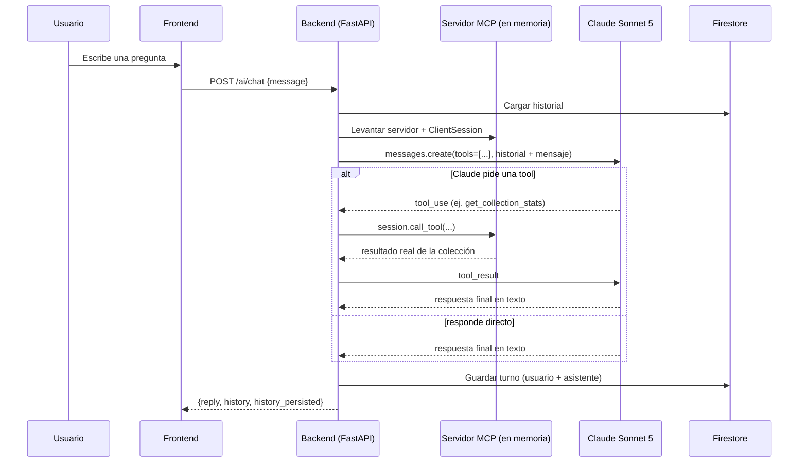

# Funcionalidades bonus de IA

Las tres funcionalidades bonus del enunciado están implementadas. Este documento
explica cómo funcionan, por qué se tomó cada decisión de arquitectura, y qué hay
que configurar a mano (nada de esto es necesario para las funciones core — sin
esta configuración, estos endpoints responden `503` con un mensaje claro, y el
resto de la app sigue funcionando normal).

## Resumen

| # | Feature | Modelo | Dónde vive |
|---|---|---|---|
| 1 | Identificar Pokémon por foto (Vision) | **Gemini 2.5 Flash** (Vertex AI / Model Garden) | `POST /api/v1/ai/vision/identify` |
| 2 | Chat sobre tu colección (MCP) | **Claude Sonnet 5** (API de Anthropic) | `POST /api/v1/ai/chat` |
| 3 | Insights de colección | **Gemini 2.5 Flash** (Vertex AI) | `GET /api/v1/ai/insights` |

## 1. Vision — identificar un Pokémon por foto

`POST /api/v1/ai/vision/identify` (multipart, campo `file`, requiere sesión) ·
`GET /api/v1/ai/vision/history` (historial de consultas pasadas, más reciente
primero, incluida la foto que subiste cada vez).

Flujo:
1. La foto se sube a Cloud Storage (o disco en local) con el mismo
   `StorageService` que ya usan las imágenes de la colección.
2. Se le pide a **Gemini 2.5 Flash** (vía el SDK `google-genai`, apuntando a
   Vertex AI) que identifique el Pokémon y redacte una descripción + un
   estimado de en qué juego apareció por primera vez y en qué zonas es fácil
   encontrarlo, con salida JSON estructurada (`response_schema`) para no
   tener que parsear texto libre.
3. **Diseño importante**: no se le pide al modelo que "recuerde" datos duros
   de la Pokédex (tabla de tipos, generación de debut, hábitat) — eso puede
   alucinarlo. En vez de eso, el nombre que identificó Gemini se resuelve
   contra **PokéAPI** (la misma fuente de verdad que usa el resto de la app)
   y ahí se calculan/consultan con datos reales:
   - Fuerte/débil contra qué tipo (`PokeAPIClient.get_type_matchups`), además
     traducido a español (`translate_types_es`) para mostrarlo en la tabla.
   - Juego de primera aparición y zonas donde es fácil encontrarlo
     (`PokeAPIClient.get_species_info`, contra `/pokemon-species/{id}` de
     PokéAPI: campos `generation` y `habitat`, con un mapeo fijo a nombres de
     juego/zona en español). El estimado del modelo se usa solo como
     respaldo si el nombre identificado no se pudo resolver contra PokéAPI.
   Si el modelo identificó algo que no existe tal cual en PokéAPI, se
   devuelve igual su descripción/estimados, sin esos campos extra ni la
   opción de "agregar a mi colección" con un id oficial.
4. La consulta completa (con la foto) se guarda en el historial de Vision del
   usuario en Firestore (colección `vision_history`, un documento por usuario
   con las últimas 50 consultas) — **best effort**: si Firestore falla, la
   identificación ya se le mostró al usuario de todos modos, simplemente no
   queda guardada para verla después.

Por qué Vertex AI / Model Garden (y no la API pública de Gemini directamente):
mantiene todo dentro de la misma cuenta de servicio y facturación de GCP que ya
usa el resto del proyecto (Cloud Run, Cloud SQL, GCS) — un solo lugar donde
gestionar IAM y costos.

En el frontend, el resultado y todo el historial se muestran en una sola
tabla (`VisionIdentifyPage.tsx`) con columnas: foto, nombre, tipo,
descripción, juego de primera aparición, zonas donde es fácil encontrarlo,
fuerte contra y débil contra (estos dos últimos ya en español).

## 2. Chat MCP — Claude Sonnet 5 sobre tu colección

`POST /api/v1/ai/chat` (body `{"message": "..."}`, requiere sesión) · `GET` /
`DELETE /api/v1/ai/chat/history`.

### Por qué Anthropic directo (y no Claude vía Vertex AI Model Garden)

GCP también ofrece modelos Claude en su Model Garden, y se pudo haber usado esa
ruta para mantener todo "dentro de GCP" como en el punto 1. Se eligió la **API
directa de Anthropic** en su lugar porque MCP es el protocolo de Anthropic, y
la API directa es donde su soporte (incluidas las convenciones de `tool_use`
que se usan aquí) está más probado y documentado — la ruta más confiable para
esta funcionalidad específica. El costo de esa decisión: necesitas tu propia
API key de Anthropic (ver "Configuración" abajo), separada de tu facturación de
GCP — es el único paso manual de todo este bonus que no se puede resolver con
un script de `gcloud`.

### Cómo funciona el servidor MCP

No hay un proceso ni un contenedor MCP aparte — sería infraestructura extra
sin necesidad real para esta app. En su lugar, **por cada mensaje de chat**:

1. Se construye un servidor MCP (`FastMCP`, del SDK oficial `mcp`) con tools
   ya "cerradas" sobre el usuario que está chateando y la sesión de base de
   datos de ESE request: `list_my_collection`, `get_collection_stats`,
   `get_pokemon_info`. El servidor literalmente no puede leer la colección de
   otro usuario — ni el modelo puede pedírselo pasándole un id, porque las
   tools no reciben `user_id` como parámetro.
2. Se conecta un `ClientSession` MCP real a ese servidor con streams **en
   memoria** (`mcp.shared.memory`, el mismo mecanismo que usa el propio SDK de
   `mcp` en sus tests) — mismo protocolo JSON-RPC de MCP, sin la capa de
   transporte de red que tendría un servidor MCP standalone (stdio o HTTP).
3. Se listan las tools del servidor y se traducen al formato de `tools` de la
   API de Claude.
4. Se llama a Claude con el historial (cargado de Firestore) + el mensaje
   nuevo. Si responde con `tool_use`, la tool se ejecuta a través del
   `ClientSession` MCP (no se llama directo a una función de Python) y su
   resultado se le devuelve a Claude como `tool_result`; esto se repite hasta
   que responde con texto final (tope de 5 iteraciones).
5. El turno completo se guarda en Firestore — **best effort**: si Firestore
   falla (por ejemplo, un problema de permisos), Claude ya respondió
   correctamente y esa respuesta se le entrega igual al usuario
   (`history_persisted: false` en la respuesta), solo no queda guardada para
   la próxima vez que abra el chat.



### Solución de problemas — "el chat no funciona"

Si `/ai/chat` responde 503, el mensaje de error (`detail`) ahora incluye la
causa real, no un mensaje genérico — dos bugs que se corrigieron:

**Antes**: cualquier error real dentro del bloque de MCP (una API key
inválida, un problema de red hacia Anthropic, lo que sea) se veía SIEMPRE
como el mismo mensaje inútil: `"unhandled errors in a TaskGroup (1
sub-exception)"`. La causa es que `create_connected_server_and_client_session`
corre el servidor y el cliente MCP dentro de un `anyio.TaskGroup`, y desde
Python 3.11 cualquier excepción que salga de ese bloque llega envuelta en un
`ExceptionGroup` — sin desenvolverla, se pierde el mensaje real. `chat.py`
ahora se desenvuelve recursivamente (`_root_cause`) antes de loguearla y
devolverla, así que el `detail` del 503 ahora sí dice, por ejemplo,
`AuthenticationError: ... invalid x-api-key ...` en vez del mensaje genérico.
Si te vuelve a pasar, el mensaje del error (o los logs de Cloud Run) ya
apuntan directo a la causa.

**Además**: antes, si el chat funcionaba bien pero SOLO fallaba el guardado
en Firestore (por ejemplo, el 403 de permisos de abajo), todo el endpoint
respondía 503 igual, descartando la respuesta de Claude que sí se había
generado correctamente. Ahora ese guardado es "best effort": la respuesta se
entrega siempre que Claude haya respondido, con `history_persisted: false`
si no se pudo guardar (el frontend muestra un aviso pequeño, no bloqueante).

Si ves el error de Firestore específicamente
(`Firestore no disponible... 403 Missing or insufficient permissions`),
revisa en orden:

1. **¿La revisión desplegada usa la service account correcta?**
   ```bash
   gcloud run services describe pokedex-manager-backend \
     --project=tu-proyecto-gcp --region=us-central1 \
     --format="value(spec.template.spec.serviceAccountName)"
   ```
   Debe imprimir `pokedex-manager-runtime@tu-proyecto-gcp.iam.gserviceaccount.com`.
   Si sale otra cosa (o la cuenta de compute por defecto), vuelve a correr
   `./08-deploy-backend.sh` — el script siempre pasa `--service-account`.

2. **¿El rol realmente está asignado?**
   ```bash
   gcloud projects get-iam-policy tu-proyecto-gcp \
     --flatten="bindings[].members" \
     --filter="bindings.role:roles/datastore.user" \
     --format="table(bindings.role,bindings.members)"
   ```
   Debe aparecer la service account de runtime. Si no sale, vuelve a correr
   `./02-service-accounts-iam.sh` (es idempotente).

3. **Espera la propagación de IAM.** Un `add-iam-policy-binding` recién
   aplicado puede tardar unos minutos en propagarse — si acabas de correr el
   paso 2, espera ~5 minutos y prueba de nuevo antes de seguir investigando.

4. **¿Existe la base de Firestore?**
   ```bash
   gcloud firestore databases list --project=tu-proyecto-gcp
   ```
   Debe listar `(default)` con `type: FIRESTORE_NATIVE`. Si no existe, corre
   `./11-setup-firestore.sh`.

5. Si con todo eso sigue el 403, revisa los logs del backend en Cloud Run
   (Cloud Console → Logging, o `gcloud run services logs read
   pokedex-manager-backend --region=us-central1 --limit=50`) — el traceback
   completo de `google.api_core` (con el mensaje de error exacto) queda ahí,
   aunque el mensaje que ve el usuario en la app sea más corto.

### Por qué Firestore para el historial

Es la opción serverless natural de GCP para este dato: documentos de tamaño
variable, sin necesidad de joins ni transacciones complejas, cero
administración (a diferencia de añadir esto a Cloud SQL, no hay que migrar un
esquema para "una conversación que crece"). Un documento por usuario en la
colección `mcp_conversations`, con el array completo de mensajes — para el
volumen de un chat personal esto es más simple que paginar una subcolección.
Esto no contradice la decisión de usar Cloud SQL para los datos core (ver
`docs/ARCHITECTURE.md`): son dos tipos de dato distintos.

Por el mismo motivo (documento semi-estructurado que crece con el tiempo, sin
joins), el historial de Vision (punto 1) reutiliza el mismo patrón en una
colección separada: `vision_history`, un documento por usuario con sus
últimas 50 consultas (incluida la foto de cada una).

## 3. Insights de colección

`GET /api/v1/ai/insights` (requiere sesión y al menos 1 Pokémon en tu
colección).

El análisis se basa **siempre en los primeros 6 Pokémon** que agregaste a tu
colección (en el orden en que los agregaste), aunque tengas más — el
endpoint los ordena por fecha de creación y recorta a 6 antes de llamar al
modelo. A Gemini 2.5 Flash se le manda ese resumen (nombres, tipos, apodos,
favoritos, niveles) y se le pide, con salida JSON estructurada:

- Un puntaje de 1 a 10 de qué tan bueno es ESE equipo de 6 (con motivo
  específico) — se muestra en el frontend como una fila de 10 pokébolas,
  tantas "llenas" como el puntaje.
- Fortalezas y debilidades específicas de esos 6 Pokémon (el prompt le pide
  explícitamente mencionarlos por nombre, no generalidades).
- Un equipo ideal de hasta 6 Pokémon, mezclando los que ya tienes
  (`already_in_collection: true`) con sugerencias nuevas — el frontend
  resalta en **naranja pastel** las que no tienes, con la razón de por qué
  te convendrían.
- 2 alternativas por cada puesto del equipo ideal, por si prefieres cambiar
  a alguno de los recomendados por otro Pokémon con un rol similar.
- Datos curiosos sobre los Pokémon de tu colección.

Los nombres que menciona el modelo (equipo ideal, alternativas, datos
curiosos) se resuelven contra PokéAPI para conseguir su sprite real — mismo
principio que Vision: nunca se le pide al modelo una URL de imagen, solo un
nombre, y la imagen sale de la fuente de verdad. El "equipo analizado" (tus
primeros 6) ni siquiera se resuelve: sale directo de tu colección en la base
de datos, así que sus imágenes son siempre exactas.

## Configuración (una sola vez)

### A. Vertex AI / Gemini (Vision + Insights) — ya viene listo si desplegaste con los scripts de `infra/gcp/`

`aiplatform.googleapis.com` y el rol `roles/aiplatform.user` para la service
account de runtime ya estaban en `01-enable-apis.sh` / `02-service-accounts-iam.sh`
desde la primera entrega (se dejaron preparados a propósito). Si corriste esos
scripts, no falta nada — el backend en Cloud Run resuelve las credenciales
automáticamente (ADC del propio servicio). Para correrlo en **local**, necesitas:

```bash
gcloud auth application-default login
# y en tu .env:
GOOGLE_CLOUD_PROJECT=tu-proyecto-gcp
```

### B. Firestore (historial del chat) — un script nuevo, una sola vez

```bash
cd infra/gcp
export PROJECT_ID=tu-proyecto-gcp
./11-setup-firestore.sh
```

Crea la base de datos Firestore en modo Native para el proyecto (es una base
por proyecto, no algo que se "despliega" por servicio). Si ya la tenías creada
de antes, el script no hace nada.

### C. Anthropic API key (chat MCP) — el único paso 100% manual

1. Crea una cuenta y una API key en
   [console.anthropic.com/settings/keys](https://console.anthropic.com/settings/keys)
   (facturación separada de GCP).
2. Guárdala en Secret Manager:
   ```bash
   cd infra/gcp
   export PROJECT_ID=tu-proyecto-gcp
   export ANTHROPIC_API_KEY=sk-ant-...
   ./06-secrets.sh
   ```
3. Vuelve a desplegar el backend (`./08-deploy-backend.sh`, o si usas CI/CD,
   agrega la sustitución `_SECRET_ANTHROPIC_API_KEY` al trigger si aún no
   existe — ver `docs/CI_CD.md` — y haz push) para que recoja el secreto nuevo.

Sin este paso, todo lo demás de la app (incluidos Vision e Insights) funciona
igual; solo `/ai/chat` responde `503` hasta que exista el secreto.

## Modelos usados (y cómo verificarlos si cambian)

- Vision e Insights: `gemini-2.5-flash` (configurable vía `GEMINI_MODEL`).
- Chat: `claude-sonnet-5` (configurable vía `ANTHROPIC_MODEL`) — es el modelo
  vigente al momento de esta entrega; si Anthropic publica una versión más
  nueva y quieres usarla, solo cambia esta variable de entorno (no hace falta
  tocar código). La lista de modelos vigentes siempre está en
  [platform.claude.com/docs/en/about-claude/models/model-ids-and-versions](https://platform.claude.com/docs/en/about-claude/models/model-ids-and-versions).

## Probar estos endpoints con Postman

Los tres requieren el mismo Bearer token que el resto de la API (ver
`docs/POSTMAN_GUIDE.md`, paso 1). Diferencias a tener en cuenta:

- `POST /ai/vision/identify` — Body → **form-data**, key `file` tipo **File**
  (igual que `/collection/<id>/image`), no JSON.
- `GET /ai/vision/history` — sin body; devuelve un arreglo (vacío si nunca
  has usado Vision), más reciente primero.
- `POST /ai/chat` — Body raw JSON `{"message": "¿qué pokémon tengo?"}`. Puede
  tardar varios segundos (dos idas y vueltas: Claude → tool → Claude). Fíjate
  en `history_persisted` en la respuesta: si sale `false`, Claude sí
  respondió pero no se pudo guardar ese turno (ver "Solución de problemas"
  arriba).
- `GET /ai/insights` — sin body; agrega antes al menos un Pokémon a tu
  colección o responde `422`. Solo analiza tus primeros 6 Pokémon aunque
  tengas más.
