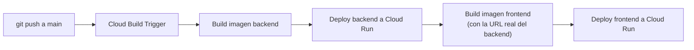

# CI/CD

El pipeline de despliegue automático de PokéDex Manager: cada push a `main`
dispara solo el build y el deploy, sin correr los scripts `.sh` a mano.

## Cómo funciona

Se usa **Cloud Build Triggers conectado directamente a GitHub** (no GitHub
Actions), porque encaja con el resto de la infraestructura: no hace falta
guardar ninguna llave de service account como secret de GitHub — Cloud
Build usa su propia identidad dentro del proyecto de GCP.



El pipeline completo vive en [`cloudbuild.yaml`](../cloudbuild.yaml) (6
pasos: build backend, push backend, deploy backend, build frontend, push
frontend, deploy frontend). Cada imagen se etiqueta con `$SHORT_SHA` (los
primeros caracteres del commit), así que Artifact Registry queda con un
historial de qué commit generó cada imagen — útil para rollback manual
(`gcloud run services update-traffic ... --to-revisions=<revision>=100`).

Los dos pasos de deploy invocan scripts dedicados, no los numerados de uso
manual: [`infra/gcp/ci-deploy-backend.sh`](../infra/gcp/ci-deploy-backend.sh)
y [`infra/gcp/ci-deploy-frontend.sh`](../infra/gcp/ci-deploy-frontend.sh).
Reciben su configuración como variables de entorno desde el propio step de
Cloud Build (`PROJECT_ID`, `REGION`, `BACKEND_SERVICE`, `IMAGE`,
`SQL_INSTANCE`, `RUNTIME_SA_EMAIL`, `GCS_BUCKET`, los `SECRET_*`,
`VERTEX_LOCATION`, `GEMINI_MODEL`, `ANTHROPIC_MODEL`) en vez de un
`00-config.sh` local, y comparten con `08-deploy-backend.sh` la librería
[`infra/gcp/lib-service-urls.sh`](../infra/gcp/lib-service-urls.sh) — nunca
se ejecutan a mano, solo Cloud Build los invoca.

## Requisitos previos

La infraestructura base ya debe existir: `01` a `09` de `infra/gcp/` ya
corridos al menos una vez (service account de runtime, bucket, Cloud SQL y
backend desplegado). Este pipeline solo reconstruye y redespliega sobre esa
infraestructura, no la crea.

## Permisos de IAM para Cloud Build

```bash
cd infra/gcp
export PROJECT_ID=tu-proyecto-gcp
./10-setup-ci-cd-iam.sh
```

Le da a la service account de Cloud Build
(`<número-de-proyecto>@cloudbuild.gserviceaccount.com`) permiso para
desplegar a Cloud Run, subir imágenes a Artifact Registry, leer secretos y
"actuar como" la service account de runtime.

## Conexión con GitHub y el disparador

Conectar el repositorio requiere autorizar la GitHub App de Cloud Build —
una autenticación OAuth que no se automatiza de forma confiable por CLI, así
que se hace una sola vez desde la consola:

1. [Cloud Build → Triggers](https://console.cloud.google.com/cloud-build/triggers) → **Conectar repositorio** → GitHub → autenticarse → seleccionar el repositorio.
2. **Crear disparador**: evento "push a una rama" (`^main$`), configuración
   "Cloud Build configuration file" apuntando a `/cloudbuild.yaml`, y las
   variables de sustitución de la tabla siguiente.
3. **Service account del trigger**: la de Cloud Build por defecto (ya tiene
   permisos del paso anterior) — no la cuenta de servicio de Compute Engine
   por defecto. Si el trigger usa esa otra cuenta, los builds pueden fallar
   sin registrar logs (`logging.logEntries.create` faltante) o sin permisos
   para desplegar.

| Variable | Valor |
|---|---|
| `_REGION` | `us-central1` |
| `_ARTIFACT_REPO` | `pokedex-manager-repo` |
| `_BACKEND_SERVICE` | `pokedex-manager-backend` |
| `_FRONTEND_SERVICE` | `pokedex-manager-frontend` |
| `_SQL_INSTANCE` | `pokedex-manager-db` |
| `_GCS_BUCKET` | `<PROJECT_ID>-pokedex-manager-images` |
| `_RUNTIME_SA_EMAIL` | `pokedex-manager-runtime@<PROJECT_ID>.iam.gserviceaccount.com` |
| `_BACKEND_URL` | URL del backend ya desplegado (`gcloud run services describe pokedex-manager-backend --region=us-central1 --format='value(status.url)'`) |
| `_GOOGLE_CLIENT_ID` | Google OAuth Client ID |

`cloudbuild.yaml` ya trae valores por defecto para las sustituciones de las
funcionalidades bonus de IA (`_SECRET_ANTHROPIC_API_KEY`, `_VERTEX_LOCATION`,
`_GEMINI_MODEL`, `_ANTHROPIC_MODEL`) — no hace falta agregarlas al trigger a
menos que se quiera cambiar esos valores. Lo que sí falta para que el chat
de IA funcione es el secreto de la API key de Anthropic (ver
[`BONUS_FEATURES.md`](BONUS_FEATURES.md)).

## Disparar el pipeline manualmente

```bash
git commit --allow-empty -m "chore: retrigger ci/cd deploy"
git push
```

También se puede volver a ejecutar un build existente desde Cloud Build →
Historial de builds → **Volver a ejecutar**, sin necesidad de un push nuevo.

## Notas operativas

- **El frontend necesita la URL del backend en tiempo de build** (Vite la
  incrusta al compilar), por eso `_BACKEND_URL` es fija en el trigger. Si el
  servicio de backend se recrea desde cero (no un simple redeploy) y cambia
  su URL, hay que actualizar esa variable.
- Cambiar contraseñas/secretos no requiere tocar el pipeline: Cloud Run
  siempre lee `:latest` de Secret Manager en cada deploy.
- Para desactivar el CI/CD temporalmente sin borrarlo: Cloud Build →
  Triggers → deshabilitar el trigger.
- **`--set-env-vars` reemplaza TODAS las variables de entorno del servicio
  en cada deploy** (no es aditivo), a diferencia de `--update-env-vars`, que
  solo toca las que se le pasan. `ci-deploy-backend.sh` y
  `08-deploy-backend.sh` incluyen explícitamente todas las variables que
  necesita el backend (incluida `CORS_ORIGINS`) precisamente por esto —
  olvidar una sola variable en la lista la borra silenciosamente en el
  próximo deploy. Si se agrega una variable de entorno nueva al backend,
  agregarla a las dos listas (el script manual y el de CI/CD), no solo a
  una.
- **Un mismo servicio de Cloud Run puede tener más de una URL "oficial"
  válida al mismo tiempo** — `gcloud run services describe
  --format='value(status.url)'` puede devolver una URL con formato legado
  (`https://servicio-xxxxxx-uc.a.run.app`) distinta a la que reporta
  `gcloud run deploy` al terminar (formato nuevo, con número de proyecto),
  y que es la que realmente usa el navegador como `Origin`. Ambas apuntan al
  mismo servicio, pero si `CORS_ORIGINS` solo tiene una de las dos, el
  navegador bloquea el origen real por CORS.

  La solución vive en `infra/gcp/lib-service-urls.sh` (usado por
  `ci-deploy-backend.sh` y `08-deploy-backend.sh`): en vez de confiar en un
  solo campo de `describe`, se piden **todas** las URLs que Cloud Run
  reconoce para el servicio del frontend
  (`metadata.annotations['run.googleapis.com/urls']`, que trae los dos
  formatos) y se incluyen todas, separadas por coma, en `CORS_ORIGINS` —
  `cors_origins_list` en `config.py` soporta múltiples orígenes separados
  por coma.

  Para un arreglo inmediato sin esperar al próximo deploy:

  ```bash
  gcloud run services update pokedex-manager-backend \
    --project=tu-proyecto-gcp \
    --region=us-central1 \
    --update-env-vars="^;^CORS_ORIGINS=https://url-1.run.app,https://url-2.run.app"
  ```

  El prefijo **`^;^`** le dice a `gcloud` que use `;` como separador entre
  variables en vez de `,`, porque el propio valor de `CORS_ORIGINS` contiene
  comas (`gcloud topic escaping`). Por eso `ci-deploy-backend.sh` y
  `08-deploy-backend.sh` usan `--set-env-vars="^;^..."` en vez de
  `--set-env-vars="..."` a secas.
