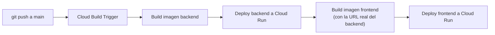

# CI/CD — despliegue automático en cada push

Por defecto, este proyecto **no** despliega nada solo: `git push` sube tu
código a GitHub, punto. Cada vez que quisiste actualizar lo que corre en
Cloud Run, tuviste que correr `07-build-push.sh`, `08-deploy-backend.sh` y
`09-deploy-frontend.sh` a mano. Esta guía conecta ambas cosas: a partir de
aquí, un push a `main` dispara solo el build y el deploy.

Se usa **Cloud Build Triggers conectado directamente a GitHub** (no GitHub
Actions) porque encaja con la infraestructura que ya armaste: no necesitas
guardar ninguna llave de service account como secret de GitHub — Cloud
Build usa su propia identidad dentro de tu proyecto de GCP.

## Requisitos previos

Debes haber corrido ya, al menos una vez, los scripts `01` a `09` de
`infra/gcp/` (o el flujo que hiciste manualmente) — este setup asume que la
service account de runtime, el bucket, Cloud SQL y el backend ya existen.

## Paso 1 — Dar permisos a Cloud Build (un solo comando)

```bash
cd infra/gcp
export PROJECT_ID=tu-proyecto-gcp
./10-setup-ci-cd-iam.sh
```

Esto le da a la service account de Cloud Build (`<numero-de-proyecto>@cloudbuild.gserviceaccount.com`)
permiso para desplegar a Cloud Run, subir imágenes a Artifact Registry, leer
secretos y "actuar como" tu service account de runtime.

## Paso 2 — Conectar tu repositorio de GitHub (una sola vez, en la consola)

Este paso requiere autorizar la GitHub App de Cloud Build — es una
autenticación OAuth que no se puede automatizar por CLI de forma confiable,
así que se hace desde la consola (2 minutos):

1. Ve a [Cloud Build → Triggers](https://console.cloud.google.com/cloud-build/triggers) en tu proyecto.
2. Click **"Conectar repositorio"** (Connect Repository).
3. Elige **GitHub** → autentícate con tu cuenta de GitHub si te lo pide.
4. Selecciona tu usuario/organización (`Adr1an-Garc1a`) y marca el repositorio `pokedex-manager`.
5. Acepta los términos y click **Conectar**.

## Paso 3 — Crear el disparador (trigger)

Todavía en la consola, en la misma pantalla de Triggers:

1. Click **"Crear disparador"** (Create Trigger).
2. **Nombre**: `pokedex-manager-deploy`
3. **Región**: la misma que usas en tus otros scripts (ej. `us-central1`)
4. **Evento**: Push a una rama
5. **Origen**: el repositorio que conectaste en el Paso 2
6. **Rama**: `^main$`
7. **Configuración**: "Cloud Build configuration file (yaml or json)" → Ubicación: `/cloudbuild.yaml`
8. **Variables de sustitución** — agrega cada una con su valor real (reemplaza según tu proyecto):

   | Variable | Valor |
   |---|---|
   | `_REGION` | `us-central1` |
   | `_ARTIFACT_REPO` | `pokedex-manager-repo` |
   | `_BACKEND_SERVICE` | `pokedex-manager-backend` |
   | `_FRONTEND_SERVICE` | `pokedex-manager-frontend` |
   | `_SQL_INSTANCE` | `pokedex-manager-db` |
   | `_GCS_BUCKET` | tu bucket, formato `<PROJECT_ID>-pokedex-manager-images` |
   | `_RUNTIME_SA_EMAIL` | `pokedex-manager-runtime@<PROJECT_ID>.iam.gserviceaccount.com` |
   | `_BACKEND_URL` | la URL de tu backend ya desplegado (`gcloud run services describe pokedex-manager-backend --region=us-central1 --format='value(status.url)'`) |
   | `_GOOGLE_CLIENT_ID` | tu Google OAuth Client ID |

   `cloudbuild.yaml` ya trae valores por defecto para las sustituciones de las
   funcionalidades bonus de IA (`_SECRET_ANTHROPIC_API_KEY`, `_VERTEX_LOCATION`,
   `_GEMINI_MODEL`, `_ANTHROPIC_MODEL`) — no hace falta agregarlas al trigger a
   menos que quieras cambiar esos valores. Lo que sí falta para que el chat de
   IA funcione es crear el secreto de la API key de Anthropic (`06-secrets.sh`)
   — ver `docs/BONUS_FEATURES.md`.

9. Service account: puedes dejar la de Cloud Build por defecto (ya le diste permisos en el Paso 1).
10. Click **Crear**.

## Paso 4 — Probarlo

Haz cualquier cambio pequeño, commit y push a `main`:

```bash
git commit --allow-empty -m "test: disparar CI/CD"
git push
```

Ve a **Cloud Build → Historial** en la consola — deberías ver el build
corriendo en segundos, con los 6 pasos definidos en `cloudbuild.yaml`
(build backend, push backend, deploy backend, build frontend, push
frontend, deploy frontend). Tarda unos minutos la primera vez.

## Cómo funciona (`cloudbuild.yaml`)



Cada imagen se etiqueta con `$SHORT_SHA` (los primeros caracteres del commit),
así que en Artifact Registry queda un historial de qué commit generó cada
imagen — útil para hacer rollback manual si algo sale mal (`gcloud run
services update-traffic ... --to-revisions=<revision-anterior>=100`).

## Notas

- El **frontend necesita conocer la URL del backend en tiempo de build**
  (Vite la incrusta al compilar), por eso `_BACKEND_URL` es fija en el
  trigger. Si alguna vez recreas el servicio de backend desde cero (no un
  simple redeploy) y cambia su URL, actualiza esa variable en el trigger.
- Si cambias contraseñas/secretos, no hace falta tocar el pipeline: Cloud
  Run siempre lee `:latest` de Secret Manager en cada deploy.
- Para desactivar el CI/CD temporalmente sin borrarlo: en Cloud Build →
  Triggers, usa el switch para deshabilitar el trigger.
- **`--set-env-vars` reemplaza TODAS las variables de entorno del servicio
  en cada deploy** (no es aditivo) — a diferencia de `--update-env-vars`,
  que solo toca las que le pasas. `ci-deploy-backend.sh` y
  `08-deploy-backend.sh` ya incluyen explícitamente todas las variables que
  necesita el backend (incluida `CORS_ORIGINS`, auto-detectada desde el
  servicio de frontend) precisamente por esto: olvidar una sola variable
  en la lista la borra silenciosamente en el próximo deploy. Si en el
  futuro agregas una variable de entorno nueva al backend, agrégala a las
  DOS listas (el script manual y el de CI/CD), no solo a una.

- **Un mismo servicio de Cloud Run puede tener más de una URL "oficial"
  válida al mismo tiempo.** Se detectó en este proyecto que
  `gcloud run services describe --format='value(status.url)'` puede
  devolver una URL con formato legado
  (`https://servicio-xxxxxx-uc.a.run.app`) distinta a la URL con formato
  nuevo (`https://servicio-<numero-de-proyecto>.<region>.run.app`) que
  reporta el propio `gcloud run deploy` al terminar, y que es la que
  realmente usa el navegador como `Origin`. Ambas apuntan al mismo
  servicio, pero si `CORS_ORIGINS` solo tiene una de las dos, el navegador
  bloquea el login por CORS aunque el backend esté sano.

  La solución, en `infra/gcp/lib-service-urls.sh` (usado por
  `ci-deploy-backend.sh` y `08-deploy-backend.sh`): en vez de confiar en un
  solo campo de `describe`, se piden **todas** las URLs que Cloud Run
  reconoce para el servicio del frontend
  (`metadata.annotations['run.googleapis.com/urls']`, que trae los dos
  formatos) y se incluyen todas, separadas por coma, en `CORS_ORIGINS` —
  `cors_origins_list` en `config.py` ya soporta múltiples orígenes
  separados por coma. Así no hace falta adivinar cuál de las dos formas es
  "la correcta" para tu proyecto.

  Si necesitas un arreglo inmediato sin esperar al próximo deploy (por
  ejemplo, mientras el pipeline de CI/CD corre de nuevo), puedes actualizar
  la variable a mano con `--update-env-vars` (que sí es aditivo, no borra
  el resto):

  ```bash
  gcloud run services update pokedex-manager-backend \
    --project=tu-proyecto-gcp \
    --region=us-central1 \
    --update-env-vars="^;^CORS_ORIGINS=https://pokedex-manager-frontend-472849722290.us-central1.run.app,https://pokedex-manager-frontend-ekqxmkc4rq-uc.a.run.app"
  ```

  Nota el prefijo **`^;^`** al inicio del valor — es importante, no es un
  error de copiado. `--update-env-vars` (y `--set-env-vars`) separan pares
  `KEY=VALOR` por coma de forma predeterminada, pero aquí el propio VALOR
  de `CORS_ORIGINS` contiene comas (porque tiene dos URLs adentro). Sin ese
  prefijo, `gcloud` corta el string en cada coma y falla con
  `Bad syntax for dict arg` porque el segundo pedazo
  (`https://pokedex-manager-frontend-ekqxmkc4rq-uc.a.run.app`) no tiene un
  `=`. El prefijo `^;^` le dice a `gcloud` "usa `;` como separador entre
  variables, no `,`", así las comas de adentro del valor quedan intactas
  (documentado en `gcloud topic escaping`). Por la misma razón,
  `ci-deploy-backend.sh` y `08-deploy-backend.sh` usan
  `--set-env-vars="^;^..."` en vez de `--set-env-vars="..."` a secas.
